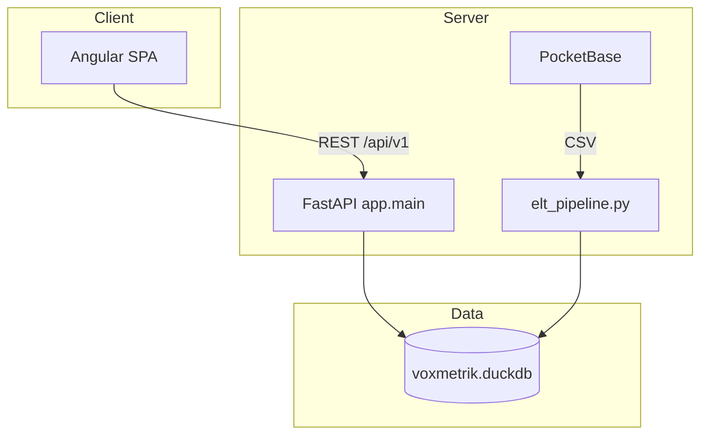

<!--
Sync Impact Report
==================
Version change: 1.1.0 → 2.0.0 (MAJOR amendment — spec 015 closed CLOSED_WITH_DEFERRED_DECISIONS)
Reason: Redefinición oficial del producto a plataforma B2B SaaS de gestión e inteligencia musical
  (cliente pagador = organización); audio deja de presentarse como negocio principal;
  dominios empresariales DESIGN_APPROVED / IMPLEMENTATION_PENDING; principios de dinero,
  multi-organización, ownership, KPIs/ROI, DuckDB académico vs SaaS transaccional.

Modified principles / sections:
  - Header alcance + vocabulario de estado (+ diseñado / futuro)
  - §1 Propósito del Proyecto (definición B2B oficial)
  - §2 Visión Empresarial (alineada a B2B; streaming como apoyo)
  - §3 Alcance (dominios técnicos vs empresariales; audio)
  - §5 P0 cadena de diseño ampliada; P2 dominios; P4 DuckDB límites;
    nuevos P10–P17 (multi-org, ownership, dinero, KPIs/ROI, honestidad)
  - §8 / §20 / §23 (DuckDB académico; audio; no compliance legal afirmado)
  - §18 (sesiones bearer / tokens opacos — no afirmar JWT)
  - §24 Glosario
  - Governance footer versión

Added: principios empresariales P10–P17; distinción DESIGN_APPROVED vs IMPLEMENTATION_PENDING
Removed: ninguna sección histórica eliminada (historial Sync Impact 1.0.0→1.1.0 conservado arriba vía este bloque)
Templates: no mandatory rewrite (plantillas Spec Kit genéricas); docs/specs futuras deben usar vocabulario ampliado
Related specs: 015-enterprise-business-foundation (fuente); 014 (estabilización previa);
  primera implementación aprobada: Identity & Organizations (sin número aún)
Accepted debts / deferred (from 015): precios/umbrales/trial/cancel; pasarela real;
  enmienda numeración specs; usuario-sin-org temporal; ingreso reconocido OOS v1
Source: automation/specs/015-enterprise-business-foundation/evidence/approved-decisions.md

Prior amendment (preserved):
Version change: 1.0.0 → 1.1.0 (amendment — spec 014 Phase B)
Modified: §1 audio reality; §3.2 audio OOS; §5 P2 package-by-domain + empty-domain ban;
  new P0 design chain; §11 specs path; §13 monorepo layout; §14 naming honesty;
  §15 Spec Kit/OpenSpec obligation; §23.3 audio legal/commercial limits;
  status vocabulary (implementado/parcial/propuesto/no comprobado); glossary Demo Player
-->

# Constitución Empresarial de Voxmetriks

**Documento:** Constitución del Proyecto Voxmetriks  
**Metodología:** GitHub Spec Kit / OpenSpec (Spec-Driven Development)  
**Alcance:** Repositorio `voxmetriks` — plataforma B2B SaaS de gestión e inteligencia musical (con capacidades analíticas y de exploración musical)  
**Autoridad:** Este documento prevalece sobre documentación legacy, specs Kiro no ratificadas y decisiones ad hoc no registradas en Specify.

**Version**: 2.0.0 | **Ratified**: 2026-06-19 | **Last Amended**: 2026-07-11

**Vocabulario de estado (obligatorio en docs/specs):**
| Etiqueta | Significado |
|----------|-------------|
| **Implementado** | Existe en código y tiene evidencia de uso o prueba |
| **Parcial** | Existe pero incompleto, con adaptadores o deuda conocida |
| **Diseñado** | Aprobado en modelo/spec empresarial; aún no implementado (DESIGN_APPROVED) |
| **Futuro** / **Propuesto** | Planificado o diferido; IMPLEMENTATION_PENDING o no iniciado |
| **Fuera de alcance** | Explicitamente excluido |
| **No comprobado** | Afirmado sin evidencia verificada en este repositorio |

---

## Tabla de Contenidos

1. [Propósito del Proyecto](#1-propósito-del-proyecto)
2. [Visión Empresarial](#2-visión-empresarial)
3. [Alcance del Sistema](#3-alcance-del-sistema)
4. [Niveles Empresariales](#4-niveles-empresariales)
5. [Principios Arquitectónicos](#5-principios-arquitectónicos)
6. [Arquitectura Oficial del Sistema](#6-arquitectura-oficial-del-sistema)
7. [Estándares Tecnológicos](#7-estándares-tecnológicos)
8. [Estrategia de Datos](#8-estrategia-de-datos)
9. [Estrategia de Calidad](#9-estrategia-de-calidad)
10. [Estrategia de Testing](#10-estrategia-de-testing)
11. [Estándares de Documentación](#11-estándares-de-documentación)
12. [Trazabilidad Empresarial](#12-trazabilidad-empresarial)
13. [Organización Oficial del Repositorio](#13-organización-oficial-del-repositorio)
14. [Convenciones de Nomenclatura](#14-convenciones-de-nomenclatura)
15. [Reglas para Especificaciones Futuras](#15-reglas-para-especificaciones-futuras)
16. [Reglas para Implementación](#16-reglas-para-implementación)
17. [Reglas para UML](#17-reglas-para-uml)
18. [Reglas para Seguridad](#18-reglas-para-seguridad)
19. [Reglas para APIs](#19-reglas-para-apis)
20. [Reglas para Data Warehouse](#20-reglas-para-data-warehouse)
21. [Reglas para ETL](#21-reglas-para-etl)
22. [Criterios de Aceptación Globales del Proyecto](#22-criterios-de-aceptación-globales-del-proyecto)
23. [Restricciones del Proyecto](#23-restricciones-del-proyecto)
24. [Glosario Empresarial de Voxmetriks](#24-glosario-empresarial-de-voxmetriks)

---

## 1. Propósito del Proyecto

VOXMETRIKS es una **plataforma B2B SaaS de gestión e inteligencia musical** dirigida a:

- artistas;
- managers;
- sellos discográficos;
- agencias;
- equipos de marketing;
- equipos financieros;
- analistas;
- dirección empresarial.

El **cliente pagador principal** es una **organización musical** (decisión aprobada, spec 015).

### 1.1 Negocio principal (**diseñado** — DESIGN_APPROVED / IMPLEMENTATION_PENDING)

Gestionar organizaciones; contratar planes; facturar y cobrar; gestionar artistas y catálogo con derechos; administrar campañas y presupuestos; medir rendimiento y ROI; producir reportes; apoyar decisiones; renovar y ampliar clientes.

Estos dominios empresariales están **diseñados** en `automation/specs/015-enterprise-business-foundation/` y **no** deben presentarse como implementados hasta specs de implementación aprobadas (primera: Identity & Organizations).

### 1.2 Capacidades técnicas actuales (**implementado / parcial**)

El sistema existente, según evidencia de código, además:

1. **Ingiere** datasets de catálogo musical (CSV vía PocketBase, Parquet local o bootstrap sintético controlado).
2. **Transforma** esos datos mediante pipeline ELT Medallion hacia un data warehouse analítico en DuckDB.
3. **Expone** catálogo, métricas, playlists, favoritos y recomendaciones vía API REST FastAPI (`/api/v1`).
4. **Presenta** una SPA Angular con navegación de catálogo, reproductor de exploración, dashboards analíticos y herramientas de data engineering.

### 1.3 Propósito del audio (no es el negocio principal)

La reproducción musical se mantiene como:

- capacidad de **exploración**;
- **apoyo** a la experiencia;
- **fuente de eventos** de engagement;
- **demostración académica**.

**MUST NOT** presentarse como servicio comercial de streaming licenciado. Las licencias y permisos del audio **no están comprobados**. YouTube, Audius y fuentes demo **no** constituyen una solución comercial garantizada. Una futura versión comercial necesitará fuentes autorizadas o deberá operar como producto analítico sin promesa de streaming licenciado.

### 1.4 Evolución

Professionalizar y evolucionar el sistema existente **sin reescritura arquitectónica gratuita**: Spec-Driven Development, preservando FastAPI, Angular y el pipeline ELT; DuckDB permanece válido para warehouse académico/analítico local, **sin** afirmarse como arquitectura SaaS transaccional definitiva (spec 015, decisión #9).

---

## 2. Visión Empresarial

### 2.1 Visión (horizonte 3–5 años)

VOXMETRIKS será la plataforma B2B de referencia para organizaciones musicales que necesiten **gestionar** roster, derechos, campañas, suscripción y facturación, y **decidir** con inteligencia musical trazable — con exploración de audio como apoyo, no como promesa de streaming comercial.

### 2.2 Misión operativa

Entregar un ecosistema donde:

- Las **organizaciones** (pagadoras) operen membresías, planes y cobros (**diseñado**).
- Los **managers / marketing / finanzas / dirección** ejecuten procesos end-to-end con estados, reglas y auditoría (**diseñado**).
- Los **analistas** exploten warehouse dimensional y KPIs con fórmula y fuente.
- Los **desarrolladores** evolucionen bajo Spec-Driven Development.
- Los **usuarios** (incl. modo legacy sin org, temporal) interactúen con catálogo, playlists y exploración de audio (**parcial / implementado**).
- Los **ingenieros de datos** operen ELT observable.

### 2.3 Propuesta de valor diferenciada

| Dimensión | VOXMETRIKS | Estado |
|-----------|------------|--------|
| Gestión + inteligencia musical B2B | Org → plan → cobro → artistas → campañas → ROI → decisión | **Diseñado** (015) |
| Unificación UX exploración + Analytics | SPA Angular + warehouse | **Parcial / implementado** |
| Warehouse académico embebido | DuckDB OLAP archivo único | **Implementado** (límites SaaS: ver §5 P4) |
| Gobernanza SDD | Spec Kit + `automation/specs/` | **Implementado** (proceso) |

### 2.4 Outcomes estratégicos

1. **Organizaciones activas y renovación** (KPIs SaaS — **diseñado**).
2. **Dinero trazable** (factura → pago → conciliación — **diseñado**).
3. **Time-to-insight** analítico sobre warehouse gobernado (**parcial**).
4. **Auditability** Spec Kit + evidencia de cierre.

---

## 3. Alcance del Sistema

### 3.1 Dentro del alcance (In Scope)

**Capacidades técnicas actuales (implementado / parcial):**

| Dominio técnico | Capacidades | Estado |
|-----------------|-------------|--------|
| identity / users | Auth, sesión bearer / token opaco, perfil | **Parcial / implementado** |
| catalog / streaming | Catálogo, playlists, favoritos; audio YT/Audius/demo | **Parcial / implementado** |
| engagement | Eventos / facts de uso | **Parcial** |
| analytics | Stats, dashboards, smart | **Parcial / implementado** |
| ai | Asistencias documentadas (naming honesto) | **Parcial** |
| platform | Health, ops transversales | **Parcial** |
| Ingesta / ELT / warehouse | Medallion → DuckDB | **Parcial / implementado** |
| Gobernanza | Constitución, Spec Kit, `automation/specs/` | **Implementado** (proceso) |

**Dominios empresariales (diseñados — DESIGN_APPROVED / IMPLEMENTATION_PENDING):**

organizations · crm · contracts · subscriptions · billing · artists empresariales · catalog_rights · campaigns · reporting empresarial · customer_success · support · compliance  

MUST NOT presentarse como carpetas, tablas o módulos existentes. Solo vía spec de implementación aprobada.

### 3.2 Fuera del alcance (Out of Scope)

| Exclusión | Razón |
|-----------|-------|
| Reescritura completa del backend o frontend | Principio "evolucionar, no reescribir" |
| Reemplazo de FastAPI o Angular | Stack inmutable salvo enmienda |
| DuckDB como arquitectura SaaS transaccional definitiva | Válido académico/analítico; migración futura diseñada en specs |
| Streaming comercial licenciado / CDN / DRM propios | Audio = exploración/demo/eventos; permisos **no comprobados** |
| Afirmar cumplimiento GDPR / PCI / ISO / SRI | Sin evidencia; no declarar |
| Pasarela de pago real ya implementada | Solo mock académico + manual/transferencia (**diseñado**); PaymentProvider **futuro** |
| Crear dominios empresariales vacíos sin spec | Prohibición package-by-domain |
| CD completo automatizado (inicialmente) | CI first |
| Autenticación OAuth externa (fase actual) | Sesiones bearer / tokens opacos actuales — **no** afirmar JWT sin evidencia |
| PocketBase como auth provider del API | Configurado pero no implementado |

### 3.3 Límites del sistema

```
┌─────────────────────────────────────────────────────────────┐
│                    FRONTERA DE VOXMETRIKS                    │
│  ┌─────────────┐  ┌─────────────┐  ┌─────────────────────┐  │
│  │ Angular SPA │◄─┤ FastAPI API │◄─┤ DuckDB Warehouse    │  │
│  └─────────────┘  └──────┬──────┘  └──────────▲──────────┘  │
│                          │                      │              │
│                   PocketBase (opcional)        ELT Pipeline    │
└─────────────────────────────────────────────────────────────┘
         ▲                              ▲
         │ Fuera: Spotify API real      │ Fuera: Kafka, Spark,
         │ Fuera: Pagos / suscripciones │        Snowflake, K8s prod
```

---

## 4. Niveles Empresariales

Voxmetriks opera en tres niveles empresariales interconectados. Cada decisión arquitectónica MUST mapearse al menos a un nivel.

### 4.1 Nivel Estratégico

**Horizonte:** visión, objetivos de negocio, outcomes, restricciones de evolución.

| Elemento | Artefacto canónico | Estado actual |
|----------|-------------------|---------------|
| Visión y propuesta de valor | Esta Constitución §2 | Ratificado |
| Diagrama casos de uso general | `README.md` (imagen UC) | Existe; complementar con texto |
| Objetivo professionalización | `.kiro/specs/.../requirements.md` | Referencia histórica; Specify prevalece |
| Principio "no reescritura" | Constitución §5, §23 | Ratificado |

**Responsabilidad:** definir *por qué* existe Voxmetriks y qué NO debe cambiar sin enmienda.

### 4.2 Nivel Táctico

**Horizonte:** arquitectura, diseño de dominios, topología de despliegue, estándares.

| Elemento | Artefacto canónico | Estado actual |
|----------|-------------------|---------------|
| Arquitectura de capas | Constitución §6 | Ratificado |
| Package-by-domain | `apps/backend/app/packages/`, `frontend/src/app/packages/` | Implementado |
| Topología Docker | `infrastructure/docker/docker-compose.yml` | Compose alineado; Dockerfile pendiente fix |
| Modelo de datos warehouse | `elt/pipelines/elt_pipeline.py`, `enterprise_analytics.py` | Implementado |
| Workflow SDD | `.specify/workflows/speckit/workflow.yml` | Instalado |
| Diseño target Kiro | `.kiro/specs/.../design.md` | Referencia; validar vs código |

**Responsabilidad:** definir *cómo* se estructura el sistema y cómo evolucionan dominios.

### 4.3 Nivel Operativo

**Horizonte:** ejecución, runbooks, scripts, health checks, pipeline runs.

| Elemento | Artefacto canónico | Estado actual |
|----------|-------------------|---------------|
| Dev local Windows | `scripts/dev_start.bat` | **Fuente operativa más fiable** |
| Pipeline ELT | `python analytics/elt/pipelines/elt_pipeline.py` | Entry point canónico |
| Validación warehouse | `scripts/validate_warehouse.py` | Disponible |
| Health API | `GET /health` | Implementado |
| Control ELT | `ctl_carga_dataset`, `ctl_auditoria`, `ctl_pipeline_stages` | Implementado |
| Configuración | `.env` (no versionado), `.env.example` | Compartido pipeline+API |
| Quickstarts legacy | `quickstart.md`, `docs/*` | **Desactualizados — no usar como runbook** |

**Responsabilidad:** definir *cómo se ejecuta* el sistema día a día.

### 4.4 Matriz de correspondencia

| Decisión | Estratégico | Táctico | Operativo |
|----------|:-----------:|:-------:|:---------:|
| Mantener DuckDB | ✓ | ✓ | ✓ |
| Medallion Bronze/Silver/Gold | ✓ | ✓ | ✓ |
| 54 endpoints API | | ✓ | ✓ |
| `dev_start.bat` como orquestador dev | | | ✓ |
| Spec Kit SDD workflow | ✓ | ✓ | ✓ |
| Etiquetado datos sintéticos | ✓ | ✓ | ✓ |

---

## 5. Principios Arquitectónicos

Todo cambio MUST evaluarse contra estos principios. Un PR que viole un principio MUST incluir justificación explícita y plan de remediación en la spec asociada.

### P0. Cadena de diseño (negocio → evidencia)

**Declaración:** El razonamiento y la documentación de cambios relevantes MUST seguir:

```text
negocio → objetivos estratégicos → objetivos tácticos → objetivos operativos
→ capacidades → procesos → actores → casos de uso → reglas → estados
→ datos → backend → frontend → reportes → KPIs → pruebas → evidencia
```

**Justificación:** Spec 015 ratifica la cadena completa. Evita crear tablas, endpoints, pantallas, reportes o funciones sin trazabilidad demostrable.

**Implicaciones:**
- Specs MUST declarar alineación a esta cadena.
- MUST NOT inventar dominios empresariales vacíos ni afirmar DESIGN_APPROVED como implementado.

### P1. Evolución sobre Reescritura

**Declaración:** El sistema existente es un activo funcional. Las mejoras MUST ser incrementales sobre la base de código actual.

**Justificación:** Kiro requirements explicita out-of-scope "complete backend rewrite". El backend expone 54 endpoints funcionales; el frontend tiene 42 componentes y 18 rutas. Reescribir implica riesgo desproporcionado sin beneficio demostrado.

**Implicaciones:**
- Refactors MUST preservar contratos API públicos salvo spec de breaking change.
- Migraciones de esquema MUST ser idempotentes (`IF NOT EXISTS`, `ALTER IF NOT EXISTS`).
- Documentación legacy se archiva, no se usa como base de reimplementación.

### P2. Package-by-Domain (Backend y Frontend)

**Declaración:** La organización del código MUST seguir **dominios técnicos** alineados entre capas. Los **dominios empresariales** solo se materializan en código tras spec de implementación aprobada.

**Dominios técnicos actuales (evidencia en código — implementado/parcial):**

| Dominio técnico | Notas |
|-----------------|-------|
| identity / users | `packages/identity` (+ shim users) |
| catalog / streaming | catálogo + audio en streaming; engagement separado parcialmente |
| engagement | eventos / uso |
| analytics | stats, smart, warehouse queries |
| ai | asistencias; naming honesto |
| platform | cross-cutting / health |

**Dominios empresariales diseñados (015 — DESIGN_APPROVED / IMPLEMENTATION_PENDING):**  
organizations, crm, contracts, subscriptions, billing, artists (empresariales), catalog_rights, campaigns, reporting (empresarial), customer_success, support, compliance.

**Prohibición:** MUST NOT crear directorios de dominio sin código real ni spec activa. MUST NOT presentar dominios empresariales no implementados como existentes.

**Justificación:** Spec 014 estabilizó packages técnicos; Spec 015 diseñó límites empresariales sin código.

### P3. Medallion Data Architecture

**Declaración:** Toda ingesta de datos MUST fluir por capas Bronze → Silver → Gold antes de consumo analítico.

**Justificación:** Implementado en `elt/pipelines/elt_pipeline.py` con directorios `data/bronze/`, `data/silver/`, `data/gold/` y carga final a DuckDB.

**Implicaciones:**
- No se permite carga directa a tablas dimensionales sin pasar por staging documentado.
- Cada ejecución MUST registrar estado en tablas `ctl_*`.

### P4. Single Warehouse Authority (analítico) + límites SaaS

**Declaración:** La fuente analítica canónica actual es un único archivo DuckDB en ruta resuelta por `apps/backend/app/core/config.py` (`{project_root}/data/warehouse/voxmetrik.duckdb`).

DuckDB es tecnología **válida** para: contexto académico; warehouse analítico; demostración local; hechos, dimensiones y agregados.

DuckDB **MUST NOT** presentarse como: arquitectura transaccional definitiva de un SaaS multiusuario; ni como prueba de alta concurrencia, alta disponibilidad o escalabilidad internacional.

Las operaciones empresariales futuras (orgs, billing, etc.) MUST diseñarse para una **migración posterior** del almacenamiento transaccional cuando la spec correspondiente lo autorice.

**Justificación:** Spec 015 decisión #9; evidencia warehouse actual.

### P5. Schema Introspection over Assumption

**Declaración:** El backend MUST NOT asumir columnas de tablas DuckDB. Los servicios MUST usar `get_table_columns()`, `table_exists()` y `safe_query()` de `app/core/database.py`.

**Justificación:** El warehouse evolucionó (enterprise layer, ALTER columns). Servicios ya implementan este patrón defensivo.

### P6. Separation: Warehouse Data vs Application Data

**Declaración:**
- **Warehouse (`dim_*`, `fact_*`, `agg_*`, `raw_*`, `ctl_*`):** poblado por ELT; lectura principal para analytics.
- **Application (`app_*`):** poblado por API en startup/mutaciones; estado de sesión, playlists, favoritos.

**Justificación:** `user_storage.py` y `app_storage.py` crean `app_*` en runtime; pipeline crea warehouse tables.

### P7. ELT-before-API

**Declaración:** La API MUST validar existencia del warehouse en startup. Endpoints analíticos MUST degradar gracefully si faltan agregados, pero `/health` MUST reportar estado real.

**Justificación:** `main.py` lifespan verifica DB; servicios analytics tienen fallbacks documentados en código.

### P8. Spec-Driven Development (SDD) / OpenSpec

**Declaración:** Todo cambio estructural o feature no trivial MUST seguir Spec Kit / OpenSpec: Constitution → Specify → [Clarify] → [Checklist] → Plan → Tasks → [Analyze] → Implement. La ubicación canónica actual de specs es **`automation/specs/`**. `.specify/` es **gobierno y tooling** (constitución, templates, scripts, workflows) — no el almacén de features.

**Justificación:** Spec Kit instalado; specs 001–015 viven en `automation/specs/`. `.specify/feature.json` apunta al feature activo (gestión manual por el equipo).

### P9. Contract-First API

**Declaración:** La OpenAPI generada en `/docs` es la referencia de contrato API. Pydantic models en `app/shared/schemas/models.py` y `frontend/shared/models/api.models.ts` MUST mantenerse alineados.

**Justificación:** 54 endpoints con validación Pydantic; frontend tipado con 514 líneas de DTOs.

### P10. Explicit Synthetic Data Boundary

**Declaración:** Datos generados por `enterprise_analytics.py` y endpoints como `POST /api/v1/stats/synthetic` MUST identificarse como **synthetic** en specs, respuestas API (metadata cuando aplique) y documentación.

**Justificación:** ~220k filas de streaming sintético mezcladas con catálogo real crean riesgo de interpretación incorrecta en analytics.

### P11. Security-by-Default for Mutations (Target State)

**Declaración:** Endpoints que mutan catálogo warehouse, generan datos sintéticos masivos o exponen explorer MUST requerir autenticación y autorización. El estado actual (CRUD catálogo sin auth) es **deuda conocida** con remediación obligatoria priorizada.

**Justificación:** Auditoría identificó POST synthetic sin auth, CORS `*`, SHA-256 sin salt.

### P12. Observability as First-Class (Target State)

**Declaración:** Logging estructurado, request correlation IDs y métricas de pipeline MUST implementarse según backlog Kiro Phase 1. `python-json-logger` en deps MUST utilizarse.

**Justificación:** Logging actual es `basicConfig`; Kiro tasks 1.1.x–1.2.x planifican structured JSON.

### P13. Multi-organización futura e aislamiento

**Declaración:** El producto B2B MUST evolucionar hacia multi-organización. Los datos empresariales MUST aislarse por `organization` cuando el dominio lo requiera. El modo **usuario sin organización** se conserva **temporalmente** por compatibilidad (decisión 015 #7); las funciones empresariales futuras MUST requerir organization context.

**Estado:** **Diseñado** (015). MUST NOT afirmar multi-tenancy implementado.

### P14. Propiedad única de datos por dominio

**Declaración:** Cada entidad conceptual MUST tener un único dominio propietario. Las dependencias entre dominios MUST ser acíclicas. Ejemplo ratificado: subscriptions publica eventos; billing consume eventos y publica pagos; la orquestación actualiza entitlements — subscriptions MUST NOT leer tablas internas de billing.

### P15. Mínimo privilegio, separación de funciones y auditoría

**Declaración:** Roles de organización y de plataforma MUST distinguirse. Operaciones sensibles MUST aplicar mínimo privilegio, separación de funciones y auditoría. Acceso cross-org de personal de plataforma MUST ser temporal, justificado y auditado.

### P16. Procesos end-to-end con estados explícitos

**Declaración:** Capacidades empresariales MUST modelarse como procesos con estados, transiciones, excepciones, aprobaciones y operaciones prohibidas antes de implementar.

### P17. Dinero trazable

**Declaración:** Todo flujo financiero futuro MUST contemplar, como mínimo: factura; intento de pago; pago; asignación (`payment_allocation`); conciliación explícita; reembolso; nota de crédito; ledger no destructivo (append-only); idempotencia (`idempotency_key`); moneda coherente (sin FX en v1 salvo spec); auditoría.

MUST NOT almacenar PAN ni CVV. MUST NOT afirmar pasarela real implementada. Alcance inicial aprobado: proveedor **simulado académico**, registro **manual/transferencia**, abstracción **PaymentProvider** futura (015 #5–#6).

### P18. KPIs con fórmula y fuente; ROI comprobable

**Declaración:** Todo KPI oficial MUST declarar fórmula, fuente, granularidad, frecuencia, propietario, limitaciones y tratamiento de nulos/denominador cero. ROI de campañas MUST calcularse solo con ingreso atribuible aprobado (definición de atribución, moneda, periodo, confianza, responsable); en caso contrario MUST reportarse **No disponible**. Streams u engagement MUST NOT convertirse en dinero sin fuente aprobada.

### P19. Naming honesto (AI / Enterprise / RC)

**Declaración:** MUST NOT usar “AI”, “Enterprise” o “RC” para sugerir capacidades inexistentes. “Enterprise” en código legacy de analytics ≠ CRM/billing implementados. Capacidades AI MUST describirse como asistidas/documentadas según evidencia.

### P20. Honestidad de estado de madurez

**Declaración:** Docs y specs MUST etiquetar capacidades como implementado, parcial, diseñado, futuro/propuesto, fuera de alcance o no comprobado. DESIGN_APPROVED ≠ IMPLEMENTATION_PENDING ≠ implementado.

---

## 6. Arquitectura Oficial del Sistema

### 6.1 Estilo arquitectónico

**Modular Monolith** en backend (FastAPI) + **SPA** en frontend (Angular) + **Embedded OLAP Warehouse** (DuckDB) + **Batch ELT Pipeline**.

No hay microservicios. La separación lógica es por packages de dominio, no por despliegue independiente.

### 6.2 Diagrama de contenedores (C4 Level 2)

```
┌──────────────────────────────────────────────────────────────────────────┐
│                           Usuario / Analista                              │
└─────────────────────────────────┬────────────────────────────────────────┘
                                  │ HTTPS
                    ┌─────────────▼─────────────┐
                    │   Angular SPA (:4200)     │
                    │   Standalone + Signals    │
                    │   packages/* domains      │
                    └─────────────┬─────────────┘
                                  │ REST /api/v1
                    ┌─────────────▼─────────────┐
                    │   FastAPI (:8000)         │
                    │   app/packages/*          │
                    │   routes → services → SQL │
                    └─────────────┬─────────────┘
                                  │ DuckDB SQL
                    ┌─────────────▼─────────────┐
                    │   DuckDB Warehouse        │
                    │   voxmetrik.duckdb        │
                    │   dim_*/fact_*/agg_*/app_*│
                    └─────────────▲─────────────┘
                                  │ ELT Load
                    ┌─────────────┴─────────────┐
                    │   ELT Pipeline (batch)    │
                    │   elt/pipelines/          │
                    │   Bronze→Silver→Gold     │
                    └─────────────▲─────────────┘
                                  │ CSV
                    ┌─────────────┴─────────────┐
                    │   PocketBase (:8090)      │
                    │   collection: datasets    │
                    └───────────────────────────┘
```

### 6.3 Capas internas del backend

```
┌─────────────────────────────────────────┐
│  Routes (HTTP handlers, thin)           │  packages/*/routes/
├─────────────────────────────────────────┤
│  Services (business logic, SQL)         │  packages/*/services/
├─────────────────────────────────────────┤
│  Shared Schemas (Pydantic DTOs)         │  app/shared/schemas/
├─────────────────────────────────────────┤
│  Core (config, database, logging)       │  app/core/
└─────────────────────────────────────────┘
         │
         ▼
    DuckDB (no ORM)
```

**Regla:** No se introduce capa Controller separada. Routes invocan Services directamente.

### 6.4 Capas internas del frontend

```
┌─────────────────────────────────────────┐
│  Pages / Feature Components             │  packages/*/
├─────────────────────────────────────────┤
│  Shared Components + Pipes              │  shared/components/
├─────────────────────────────────────────┤
│  Domain Services (HttpClient)           │  packages/*/services/, core/
├─────────────────────────────────────────┤
│  Guards + Interceptors                  │  core/guards/, core/interceptors/
├─────────────────────────────────────────┤
│  Models (DTOs)                          │  shared/models/api.models.ts
└─────────────────────────────────────────┘
```

### 6.5 Flujo de datos end-to-end

```
PocketBase CSV ──► Bronze Parquet ──► Silver Parquet ──► Gold DuckDB + Gold Parquet
                                                              │
                                                              ├──► Analytics API
                                                              ├──► Explorer API
                                                              └──► Catalog CRUD API
                                                                       │
User Actions ──► app_* tables ◄──────────────────────────────────────┘
(playlists, favorites, sessions)
```

### 6.6 Dependencias entre componentes

| Componente | Depende de | Contrato |
|------------|------------|----------|
| Frontend | FastAPI `/api/v1` | OpenAPI + `api.models.ts` |
| FastAPI analytics | Warehouse `agg_*`, `fact_*` | SQL + schema introspection |
| FastAPI streaming CRUD | Warehouse `dim_*` | SQL parametrizado |
| FastAPI user features | `app_*` tables | Auth Bearer token |
| ELT Pipeline | PocketBase o Parquet o bootstrap | `.env`, `PB_COLLECTION=datasets` |
| Docker API | Pipeline exit 0 + volume duckdb | `depends_on: service_completed_successfully` |

---

## 7. Estándares Tecnológicos

### 7.1 Frontend

| Atributo | Estándar | Versión pin (evidencia) |
|----------|----------|-------------------------|
| Framework | Angular standalone components | `^21.2.0` (`package.json`) |
| State | Signals + RxJS Observables | Angular 21 signals-first |
| Routing | Lazy `loadComponent()` | `app.routes.ts` |
| HTTP | `HttpClient` + `withFetch()` | `app.config.ts` |
| i18n | Custom `I18nService` + `TranslatePipe` | ES/EN |
| Testing | Vitest via `@angular/build:unit-test` | vitest `^4.0.8` |
| Linting/format | Prettier | `^3.8.1` |
| UI libraries | **Prohibido** introducir Material/PrimeNG sin spec | Custom CSS design system |
| TypeScript | strict mode | `tsconfig.json` |

**Reglas:**
- MUST NOT usar NgModules en código nuevo.
- MUST lazy-load feature routes.
- MUST tipar respuestas API con `api.models.ts`.
- `environment.prod.ts` MUST configurarse con URL API de producción antes de deploy (actualmente apunta a localhost — deuda).

### 7.2 Backend

| Atributo | Estándar | Versión pin |
|----------|----------|-------------|
| Framework | FastAPI | `0.111.0` (`backend/requirements.txt`) |
| Server | Uvicorn | `0.30.1` |
| Validation | Pydantic v2 | `2.7.4` |
| Config | pydantic-settings | `2.3.4` |
| Database driver | duckdb | `1.1.3` |
| Python | 3.12 | **Prohibido 3.13+** (compat wheels) |
| Entry point | `apps/backend/app/main.py` | `uvicorn app.main:app` desde `apps/backend/` |
| Pattern | routes → services → SQL | Sin ORM |

**Reglas:**
- MUST NOT compilar dependencias desde fuente (wheels prebuilt only).
- MUST usar `backend/requirements.txt` como única fuente de dependencias Python (API + ELT + tests).
- MUST usar `get_conn()` / `get_write_conn()` para acceso DuckDB.

### 7.3 Datos

| Atributo | Estándar |
|----------|----------|
| Warehouse engine | DuckDB 1.1.3 |
| Processing | Pandas 2.2.2, PyArrow 16.1.0 |
| Formato intermedio | Parquet |
| Modelo | Star schema + enterprise extensions |
| DDL authority | `elt/pipelines/elt_pipeline.py` + `elt/transform/enterprise_analytics.py` |
| Legacy DDL | `archive/legacy/schema.sql` — **NO autoritativo**; DDL canónico en ELT |
| Datos versionados | **Prohibido** commitear `.duckdb`, `.parquet`, `.csv` (`.gitignore`) |

### 7.4 Infraestructura

| Atributo | Estándar |
|----------|----------|
| Dev orchestration | `scripts/dev_start.bat` (Windows), equivalente shell para Unix |
| Config | `.env` (local, gitignored), `.env.example` (template) |
| Git hooks | `.githooks/commit-msg` |
| Spec Kit CLI | specify-cli 0.11.3, integración cursor-agent |
| CI (target) | GitHub Actions: pytest + lint (Kiro Phase 1) |

### 7.5 Contenedores

| Atributo | Estándar |
|----------|----------|
| Base image | `python:3.12-slim` |
| Compose services | `pipeline`, `api`, `pocketbase` |
| Pipeline command | `python analytics/elt/pipelines/elt_pipeline.py` |
| API command | `uvicorn app.main:app --host 0.0.0.0 --port 8000` |
| DB volume | `duckdb_data:/app/data/warehouse` |
| PocketBase image | `spectado/pocketbase:latest` |

**Deuda Docker (MUST remediar):** Dockerfile MUST copiar directorio `elt/` completo, eliminar referencia a `elt_pipeline.py` in raíz, alinear `DB_PATH` y `CMD` con compose.

---

## 8. Estrategia de Datos

### 8.1 Bronze (Raw Landing)

**Ubicación:** `data/bronze/raw_spotify.parquet`

**Contenido:** Extract sin transformación significativa desde:
1. PocketBase CSV (primario)
2. Parquet local existente (fallback)
3. `bootstrap_catalog.py` — 8.500 tracks sintéticos (último fallback)

**Reglas:**
- Bronze MUST preservar datos fuente para reprocesamiento.
- MUST registrar modo de ingesta en `ctl_carga_dataset`.

### 8.2 Silver (Cleaned / Conformed)

**Ubicación:** `data/silver/silver_spotify.parquet`

**Transformaciones obligatorias:**
- Renombrado de columnas según mapa del pipeline
- Coerción de tipos
- Deduplicación por `track_id`
- Eliminación de filas con `track_name` nulo

**Reglas:**
- Silver es la entrada única autorizada para construcción de dimensiones Gold.

### 8.3 Gold (Curated / Analytics-Ready)

**Ubicación dual:**
- DuckDB: `data/warehouse/voxmetrik.duckdb`
- Export Parquet: `data/gold/*.parquet`

**Contenido:**
- Staging: `raw_spotify`
- Dimensiones: `dim_artista`, `dim_genero`, `dim_album`, `dim_track`, `dim_usuario`, `dim_playlist`, `dim_tiempo`
- Hechos: `fact_streaming` (+ columnas enterprise)
- Agregados: 15+ tablas `agg_*`
- Enterprise facts: `fact_user_activity`, `fact_searches`, `fact_stream_sessions`, etc.
- Control: `ctl_carga_dataset`, `ctl_auditoria`, `ctl_pipeline_stages`

**Capa Enterprise (`enterprise_analytics.py`):**
- Genera datos de comportamiento **sintéticos** para demos analíticos
- MUST etiquetarse como synthetic en toda documentación consumidor

### 8.4 Application Layer (`app_*`)

Creada en runtime por API, separada del pipeline:

| Tabla | Propósito |
|-------|-----------|
| `app_user` | Credenciales, plan, preferencias |
| `app_session` | Tokens de sesión |
| `app_playlist` | Playlists usuario |
| `app_playlist_track` | Tracks en playlist |
| `app_favorite` | Favoritos |

### 8.5 Política de calidad de datos

| Regla | Descripción |
|-------|-------------|
| Idempotencia | Pipeline MUST ser re-ejecutable sin corrupción |
| Auditoría | Toda carga MUST escribir en `ctl_*` |
| Validación post-ELT | `scripts/validate_warehouse.py` MUST ejecutarse tras pipeline en CI |
| Provenance | Responses analytics SHOULD incluir metadata de fuente (real/synthetic) cuando mezclen capas |
| No silent schema drift | Cambios DDL MUST actualizar pipeline Python, no solo `archive/legacy/schema.sql` |

---

## 9. Estrategia de Calidad

### 9.1 Dimensiones de calidad

| Dimensión | Definición Voxmetriks | Mecanismo |
|-----------|----------------------|-----------|
| **Funcional** | Endpoints y UI cumplen specs | Tests + manual QA + `/speckit-analyze` |
| **Datos** | Warehouse consistente post-ELT | `validate_warehouse.py`, `ctl_*` |
| **Contrato** | API ↔ Frontend alineados | OpenAPI + `api.models.ts` diff |
| **Seguridad** | Auth en mutaciones sensibles | Auth deps + future RBAC |
| **Mantenibilidad** | Package-by-domain, no dead code | Code review + lint |
| **Observabilidad** | Trazabilidad requests y pipeline | Structured logging (target) |

### 9.2 Gates de calidad SDD

Flujo obligatorio para features de producción:

```
/speckit-specify → /speckit-clarify → /speckit-checklist → /speckit-plan
    → /speckit-tasks → /speckit-analyze → /speckit-implement
```

`/speckit-analyze` MUST ejecutarse **antes** de implement si hay ambigüedad material.

### 9.3 Definition of Done (feature)

Una feature está DONE cuando:

1. Spec, plan y tasks están en `specs/NNN-feature/` y committed.
2. Implementación cumple criterios de aceptación de la spec.
3. Tests nuevos pasan (cuando aplique §10).
4. OpenAPI refleja cambios API.
5. No introduce regresiones en `/health`.
6. Constitution Check en plan.md está marcado PASS.
7. PR referencia spec directory y branch `NNN-feature-name`.

### 9.4 Deuda técnica conocida (registro obligatorio)

| ID | Deuda | Prioridad | Remediación |
|----|-------|-----------|-------------|
| TD-001 | Tests backend obsoletos | Alta | Reescribir contra `app.main:app`, `/api/v1` |
| TD-002 | Dockerfile desalineado | Alta | Copiar `elt/`, fix CMD/DB_PATH |
| TD-003 | CRUD catálogo sin auth | Alta | Spec security-hardening |
| TD-004 | SHA-256 passwords | Alta | bcrypt/argon2 migration spec |
| TD-005 | Docs legacy paths | Media | Spec documentation-reconciliation |
| TD-006 | `archive/legacy/schema.sql` stale | Media | Archivado |
| TD-007 | Historial solo localStorage | Media | Integrar `/analytics/history` |
| TD-008 | Dual requirements.txt | — | **Cerrado** — solo `backend/requirements.txt` |
| TD-009 | Frontend prod env localhost | Media | Config deploy spec |
| TD-010 | CORS `*` | Alta | Environment-specific origins |

---

## 10. Estrategia de Testing

### 10.1 Pirámide de pruebas target

```
        ┌─────────┐
        │  E2E    │  (futuro — smoke Docker compose)
       ┌┴─────────┴┐
       │ Integration│  Pipeline→Warehouse→API health
      ┌┴────────────┴┐
      │  Unit/Service │  pytest services, Vitest services
     ┌┴──────────────┴┐
     │  Contract       │  OpenAPI schema validation
     └─────────────────┘
```

### 10.2 Backend

| Tipo | Framework | Alcance mínimo target |
|------|-----------|----------------------|
| API integration | pytest + FastAPI TestClient | `/health`, CRUD artists/tracks, auth flow |
| Service unit | pytest | SQL services con DuckDB in-memory o test file |
| Pipeline smoke | pytest/script | `run_pipeline()` dry-run o post-run counts |

**Estado actual:** `apps/backend/tests/test_api.py` incompatible — MUST reescribirse antes de expandir coverage.

**Regla:** pytest MUST añadirse a `backend/requirements.txt` o grupo dev documentado.

### 10.3 Frontend

| Tipo | Framework | Alcance mínimo target |
|------|-----------|----------------------|
| Component | Vitest | AuthService, TracksService, StatsService |
| Guard | Vitest | authGuard, guestGuard |
| Smoke | Vitest | App bootstrap |

**Estado actual:** 1 spec (`app.spec.ts`) con assertion drift — MUST corregirse.

### 10.4 CI (target — Kiro Phase 1)

```yaml
# Target pipeline (no implementado aún)
- pip install -r backend/requirements.txt
- pytest apps/backend/tests/
- cd apps/frontend && npm test
- ruff/flake8 backend (cuando se adopte)
```

### 10.5 Reglas

- MUST NOT merge features que rompan tests existentes (cuando estén verdes).
- MUST añadir test por cada nuevo endpoint público.
- MUST añadir test por cada guard/interceptor de seguridad nuevo.
- Synthetic data generation endpoints MUST tener tests de autorización (cuando se añada auth).

---

## 11. Estándares de Documentación

### 11.1 Jerarquía de autoridad documental

| Prioridad | Fuente | Uso |
|:---------:|--------|-----|
| 1 | **Esta Constitución** (`.specify/memory/constitution.md`) | Principios, restricciones, gobernanza |
| 2 | **`automation/specs/NNN-feature/`** (Specify / OpenSpec) | Requisitos activos por feature |
| 3 | **OpenAPI `/docs`** | Contrato API runtime |
| 4 | **Código fuente** (`analytics/elt/`, `apps/backend/`, `apps/frontend/`) | Comportamiento real |
| 5 | **`.specify/`** (templates, scripts, workflows) | Tooling SDD — no almacén de features |
| 6 | **`.kiro/specs/`** | Referencia histórica — NO activa sin migración |
| 7 | **`docs/`, quickstarts** | Legacy — archivar o regenerar |

### 11.2 Documentos obligatorios por feature (Specify)

```
automation/specs/NNN-feature-name/
├── spec.md
├── plan.md
├── tasks.md
├── checklist.md          # o checklists/ según feature
├── research.md           # opcional
├── data-model.md         # opcional
└── contracts/            # opcional
```

**Nota:** No crear specs nuevas bajo `.specify/` ni bajo `specs/` en la raíz si el proyecto ya usa `automation/specs/` (ubicación canónica actual).

### 11.3 Reglas de escritura

- MUST escribir en español o inglés consistente por documento (no mezclar en mismo archivo).
- MUST usar terminología del Glosario §24.
- MUST referenciar rutas canónicas, no paths legacy.
- MUST marcar datos synthetic explícitamente.
- MUST incluir fecha y versión en specs.

### 11.4 Migración Kiro → Specify

- Contenido de `.kiro/specs/voxmetrik-professionalization/` MAY usarse como input para specs Specify.
- MUST NOT mantener dos sistemas activos para la misma feature.
- Tras migración, Kiro spec MUST marcarse "superseded by specs/NNN-*".

---

## 12. Trazabilidad Empresarial

### 12.1 Cadena de trazabilidad oficial

Voxmetriks adopta la siguiente cadena obligatoria para features empresariales:

```
OE → OT → OO → Meta → Departamento → Paquete → Caso de Uso → Historia de Usuario
  → Especificación → Implementación
```

### 12.2 Definición de eslabones

| Eslabón | Código | Descripción | Artefacto Specify/Git |
|---------|--------|-------------|----------------------|
| Objetivo Estratégico | **OE** | Meta de negocio de alto nivel | Constitución §2, roadmap |
| Objetivo Táctico | **OT** | Iniciativa que contribuye a OE | `spec.md` sección Strategic Alignment |
| Objetivo Operativo | **OO** | Resultado medible entregable | `spec.md` Success Metrics |
| Meta | **Meta** | KPI cuantificable | `spec.md` Acceptance Criteria |
| Departamento | **Departamento** | Área responsable (Data, Platform, UX) | `plan.md` Ownership |
| Paquete | **Paquete** | Dominio código (`streaming`, `analytics`, etc.) | `plan.md` Project Structure |
| Caso de Uso | **CU** | Interacción actor-sistema | `spec.md` User Scenarios |
| Historia de Usuario | **HU** | "Como [rol], quiero [acción], para [beneficio]" | `spec.md` User Stories P1/P2/P3 |
| Especificación | **Spec** | Documento formal de requisitos | `specs/NNN-*/spec.md` |
| Implementación | **Impl** | Código + tests + commits | Branch `NNN-*`, PRs |

### 12.3 Matriz de trazabilidad (plantilla)

Cada `spec.md` MUST incluir tabla:

| OE | OT | OO | Meta | Dept | Paquete | CU | HU | Spec | Impl |
|----|----|----|------|------|---------|----|----|------|------|
| OE-01 | OT-01 | OO-01 | M-01 | Data | analytics | CU-01 | US-01 | spec.md | PR #N |

### 12.4 Trazabilidad técnica Git

| Elemento | Convención |
|----------|------------|
| Branch | `NNN-feature-short-name` (Specify sequential) |
| Spec directory | `specs/NNN-feature-short-name/` |
| Commit message | Referenciar spec: `feat(analytics): implement trending filter (automation/specs/003-trending-filters)` |
| PR description | Link a spec.md + plan.md + tasks completados |

### 12.5 Trazabilidad de datos (ELT)

| Evento | Registro |
|--------|----------|
| Pipeline run | `ctl_carga_dataset`, `ctl_pipeline_stages` |
| Auditoría | `ctl_auditoria` |
| API load history | `GET /api/v1/stats/loads` |

---

## 13. Organización Oficial del Repositorio

```
voxmetriks/                          # Raíz del monorepo (NO mover)
├── .cursor/                         # Reglas y skills Cursor + Spec Kit
│   ├── rules/
│   └── skills/speckit-*/
├── .specify/                        # Gobierno + tooling Spec Kit (NO es almacén de features)
│   ├── memory/constitution.md       # ESTE DOCUMENTO
│   ├── feature.json                 # Feature activo → automation/specs/...
│   ├── templates/
│   ├── scripts/
│   └── workflows/
├── apps/
│   ├── backend/                     # FastAPI + tests (canónico)
│   │   └── app/
│   │       ├── main.py
│   │       ├── core/
│   │       ├── platform/            # parcial
│   │       ├── api/                 # routers / fachada
│   │       └── packages/            # streaming, analytics, users, ai, …
│   └── frontend/                    # Angular SPA (canónico)
│       └── src/app/
│           ├── core/
│           ├── layouts/             # shell futuro = propuesto
│           ├── packages/
│           ├── features/            # residual — consolidación propuesta (014)
│           ├── playback-core/       # dirección futura documentada
│           └── shared/
├── analytics/
│   └── elt/                         # Pipeline Medallion (declarado canónico en 014)
├── automation/
│   ├── specs/                       # Specs Specify canónicas (001–014…)
│   ├── playwright/                  # E2E
│   └── scripts/                     # validate_warehouse, smokes
├── infrastructure/                  # Docker/Makefile compose
├── data/                            # bronze/silver/gold/warehouse (gitignored parcial)
├── docs/
├── archive/                         # Histórico
├── Makefile                         # Delega a infrastructure/
└── README.md
```

**Reglas estructurales:**
- MUST NOT crear dominios fuera de `packages/` sin spec.
- MUST NOT crear carpetas de dominios empresariales vacíos (CRM, billing, organizations, …).
- MUST NOT mover `.specify/` ni `.cursor/skills/speckit-*` sin comandos de integración Specify.
- Nuevas features Specify van en `automation/specs/`, NO en `.kiro/specs/` ni dentro de `.specify/`.
- Rutas legacy `backend/`, `frontend/`, `elt/`, `specs/` en raíz, si existen, son históricas o stubs — el canónico operativo es `apps/` + `analytics/elt` + `automation/specs`.

---

## 14. Convenciones de Nomenclatura

### 14.1 Proyecto y producto

| Contexto | Nombre oficial |
|----------|----------------|
| Producto / marca | **Voxmetriks** |
| Código interno / API metadata | **VOXMETRIK_V2** (identificador legacy de codebase — no implica “v2 de producto” comercial) |
| Repositorio | `voxmetriks` |
| Base de datos | `voxmetrik.duckdb` |

### 14.1.1 Naming honesto (AI, Enterprise, RC)

| Término | Uso permitido | Prohibido |
|---------|---------------|-----------|
| **AI** | Asistentes/explicaciones/recomendaciones con proveedor local/externo/mock documentado | Afirmar autonomía general o “IA de producción certificada” sin evidencia |
| **Enterprise** | Capa analítica/synthetic o rutas etiquetadas enterprise en código | Afirmar ERP/CRM/billing multi-tenant completo |
| **RC / Release Candidate** | Hitos de endurecimiento con checklist | Afirmar readiness de producción global sin gates G1–G9 / evidencia |

### 14.2 Código backend (Python)

| Elemento | Convención | Ejemplo |
|--------|------------|---------|
| Packages | snake_case | `streaming`, `analytics` |
| Modules | snake_case | `track_service.py` |
| Routes prefix | `/api/v1/{resource}` | `/api/v1/tracks` |
| Functions | snake_case | `list_tracks()` |
| Pydantic models | PascalCase | `Track`, `PaginatedResponse` |
| Tables warehouse | snake_case prefix | `dim_track`, `fact_streaming`, `agg_*`, `app_*`, `ctl_*` |

### 14.3 Código frontend (TypeScript/Angular)

| Elemento | Convención | Ejemplo |
|--------|------------|---------|
| Components | kebab-case files, PascalCase class | `track-detail.component.ts` |
| Services | kebab-case + `.service.ts` | `tracks.service.ts` |
| Routes | kebab-case paths | `/audio-features` |
| Models/Interfaces | PascalCase | `Track`, `AuthResponse` |
| Signals | camelCase | `authState` |

### 14.4 Spec Kit / Git

| Elemento | Convención | Ejemplo |
|--------|------------|---------|
| Feature branch | `NNN-short-name` | `001-docker-stabilization` |
| Spec directory | `automation/specs/NNN-short-name/` | `automation/specs/014-repository-stabilization-domain-foundation/` |
| Short name | 2-4 words kebab-case | `user-auth`, `elt-fix` |

### 14.5 Tablas DuckDB (prefijos obligatorios)

| Prefijo | Capa |
|---------|------|
| `raw_` | Staging |
| `dim_` | Dimensión |
| `fact_` | Hecho |
| `agg_` | Agregado |
| `app_` | Aplicación (API-managed) |
| `ctl_` | Control / auditoría |

---

## 15. Reglas para Especificaciones Futuras

### 15.1 Cuándo crear spec

MUST crear spec via Spec Kit (`/speckit-specify` / OpenSpec) en `automation/specs/` cuando:

- Nueva feature visible para usuario o API pública
- Cambio estructural de monorepo / package-by-domain
- Cambio breaking en contrato API
- Modificación DDL warehouse
- Cambio en pipeline ELT
- Remediación de deuda técnica TD-001 a TD-010
- Introducción de dependencia major nueva
- Introducción de un dominio empresarial nuevo (CRM, billing, orgs, …) — **solo entonces** se crean esas carpetas

MAY omitir spec para: typo fixes, formatting, dependency patch sin behavior change.

### 15.2 Contenido mínimo de spec.md

1. Strategic Alignment (OE/OT/OO)
2. User Stories priorizadas P1/P2/P3 — independientemente testables
3. Acceptance Scenarios (Given/When/Then)
4. Out of Scope explícito
5. Data impact assessment (warehouse/app tables afectadas)
6. Security impact assessment
7. Synthetic vs real data declaration

### 15.3 Flujo obligatorio

```
/speckit-constitution (referencia) → /speckit-specify → /speckit-clarify (si ambigüedad)
→ /speckit-checklist → /speckit-plan → /speckit-tasks → /speckit-analyze → /speckit-implement
```

### 15.4 Coexistencia con Kiro

- `.kiro/specs/` es **read-only reference** post-ratificación.
- Nuevas specs MUST NOT crearse en `.kiro/`.
- Backlog Kiro tasks.md MAY mapearse a specs Specify individuales.

---

## 16. Reglas para Implementación

### 16.1 Principios de implementación

1. **Minimal diff:** cambios MUST ser el conjunto mínimo que satisface la spec.
2. **Match conventions:** código nuevo MUST parecer escrito por el mismo autor del dominio.
3. **No over-engineering:** no abstraer prematuramente; no helpers de una línea.
4. **Reuse services:** extender services existentes antes de duplicar SQL.

### 16.2 Orden de implementación por capa

```
1. DDL / Pipeline (si data impact)
2. Backend services + routes + Pydantic models
3. Frontend models (api.models.ts) + services + components
4. Tests
5. Docs / OpenAPI verification
```

### 16.3 Reglas backend

- SQL MUST ser parametrizado (`?` placeholders).
- Escrituras MUST usar `get_write_conn()` con lock.
- Nuevos endpoints MUST registrarse en router del dominio correspondiente.
- MUST NOT importar ORM.

### 16.4 Reglas frontend

- MUST usar standalone components.
- MUST lazy-load nuevas rutas en `app.routes.ts`.
- MUST NOT hardcodear URLs API; usar `environment.apiUrl`.
- MUST usar `TranslatePipe` para strings UI visibles.
- Dead code (componentes no importados) MUST eliminarse en spec de cleanup.

### 16.5 `/speckit-implement` prerequisites

- `tasks.md` existe y está completo.
- `/speckit-analyze` PASS (o excepción documentada).
- Checklists en `checklists/` completos (o override aprobado).

---

## 17. Reglas para UML

### 17.1 Cuándo producir UML

MUST incluir diagramas UML en `plan.md` o `design.md` de la spec cuando:

- Nueva interacción entre 3+ componentes
- Cambio en modelo de datos con 3+ entidades nuevas
- Nuevo flujo auth/autorización
- Modificación pipeline ELT con stages nuevos

### 17.2 Tipos de diagramas permitidos

| Tipo | Uso Voxmetriks | Herramienta |
|------|----------------|-------------|
| **Component Diagram** | Dominios backend/frontend | Mermaid en Markdown |
| **Sequence Diagram** | Flujos API, ELT, auth | Mermaid |
| **Entity-Relationship** | Cambios warehouse | Mermaid erDiagram |
| **Deployment Diagram** | Docker topology | Mermaid / ASCII |
| **Use Case** | Actores vs sistema | Referencia README diagram |

### 17.3 Reglas de modelado

- MUST usar nombres oficiales del Glosario.
- MUST marcar componentes `<<synthetic>>` cuando generen datos sintéticos.
- MUST alinear packages UML con `packages/` del repo.
- MUST NOT inventar componentes no existentes sin spec que los introduzca.
- Diagramas MUST vivir en repo (Markdown/Mermaid), no solo en herramientas externas.

### 17.4 Ejemplo canónico (deployment)



---

## 18. Reglas para Seguridad

### 18.1 Postura actual (as-is — auditada)

| Control | Estado | Riesgo |
|---------|--------|--------|
| Password hash | SHA-256 sin salt | **Crítico** |
| Session tokens | UUID opaco / sesión bearer en DuckDB (MUST NOT afirmar JWT sin evidencia) | Aceptable dev; mejorar prod |
| Auth coverage | Parcial (playlists/favorites/me) | **Alto** |
| CORS | `allow_origins=["*"]` | **Alto** en prod |
| Demo credentials | `demo/demo123`, `admin/admin123` | **Alto** en prod |
| Rate limiting | Ausente | Medio |
| HTTPS | No enforced | Medio |
| Synthetic POST | Sin auth, hasta 2M filas | **Crítico** |

### 18.2 Target state (obligatorio antes de producción)

1. **Password hashing:** bcrypt o argon2 con salt — spec `security-auth-hardening`.
2. **Auth on mutations:** todo POST/PUT/DELETE de catálogo y synthetic MUST requerir Bearer token.
3. **RBAC mínimo:** roles `user`, `engineer`, `admin` — engineer para ELT/explorer (evolución de `hasEngineerAccess()`).
4. **CORS:** origins explícitos por environment.
5. **Demo seeds:** ONLY en `ENV=development`; MUST NOT existir en prod.
6. **Secrets:** `.env` gitignored; `.env.example` sin credenciales reales.
7. **Session expiry:** mantener 1d/90d; añadir endpoint logout que invalide token.
8. **SQL injection:** mantener queries parametrizadas; whitelist estricta en explorer table names (ya parcialmente implementado).

### 18.3 Reglas para implementadores

- MUST NOT loguear passwords, tokens completos ni PII en logs.
- MUST NOT commitear `.env`.
- MUST evaluar auth impact en toda spec con mutación de datos.
- MUST usar `auth_deps.resolve_session()` para endpoints protegidos.

---

## 19. Reglas para APIs

### 19.1 Estándares REST

| Atributo | Estándar |
|----------|----------|
| Base path | `/api/v1` |
| Versioning | Prefijo v1; breaking changes → v2 con spec |
| Format | JSON |
| Pagination | `page`, `limit` query params → `PaginatedResponse` |
| Errors | HTTP status codes semánticos; JSON `{detail: ...}` FastAPI default |
| Auth header | `Authorization: Bearer <token>` |
| Docs | OpenAPI auto `/docs`, `/redoc` |

### 19.2 Inventario oficial de dominios API

| Dominio | Prefix | Endpoints | Auth default |
|---------|--------|-----------|--------------|
| Artists | `/artists` | 7 | None (deuda) |
| Genres | `/genres` | 6 | None (deuda) |
| Tracks | `/tracks` | 8 | None (deuda) |
| Playlists | `/playlists` | 7 | Required |
| Favorites | `/favorites` | 3 | Required |
| Stats | `/stats` | 8 | None (deuda) |
| Analytics | `/analytics` | 8 | Mixed |
| Users | `/users` | 4 | Mixed |
| System | `/`, `/health` | 2 | None |

**Total: 54 endpoints**

### 19.3 Reglas de evolución API

- MUST actualizar `app/shared/schemas/models.py` y `frontend/.../api.models.ts` en mismo PR.
- MUST NOT eliminar endpoint sin deprecation spec y periodo de gracia documentado.
- MUST documentar auth requirements en OpenAPI `dependencies` cuando se añada auth.
- Nuevos endpoints MUST ubicarse en router del dominio correcto bajo `packages/*/routes/`.

### 19.4 Frontend integration

- `apiInterceptor` MUST continuar adjuntando token para URLs `/api/v1`.
- `environment.apiUrl` MUST apuntar a API real por environment.

---

## 20. Reglas para Data Warehouse

### 20.1 Autoridad DDL

| Fuente | Autoridad |
|--------|-----------|
| `elt/pipelines/elt_pipeline.py` DDL_STATEMENTS | **Canónica** dims/facts base |
| `elt/transform/enterprise_analytics.py` | **Canónica** enterprise layer |
| `user_storage.py`, `app_storage.py` | **Canónica** `app_*` |
| `archive/legacy/schema.sql` | **No canónica** — archivada |

### 20.2 Modelo dimensional oficial

**Dimensiones:** `dim_artista`, `dim_genero`, `dim_album`, `dim_track`, `dim_usuario`, `dim_playlist`, `dim_tiempo`

**Hechos core:** `fact_streaming`

**Hechos enterprise:** `fact_user_activity`, `fact_playlist_activity`, `fact_favorites`, `fact_searches`, `fact_stream_sessions`

**Agregados:** `agg_top_artistas`, `agg_genero_popularidad`, `agg_distribucion_energia`, `agg_tracks_populares`, `agg_daily_streams`, `agg_user_activity`, `agg_genre_trends`, `agg_artist_growth`, `agg_platform_usage`, `agg_top_playlists`, `agg_recommendation_scores`, `agg_user_engagement`, `agg_streaming_devices`, `agg_recent_activity`, `agg_top_searches`, `agg_user_retention`

### 20.3 Reglas de evolución de esquema

1. Cambios MUST ser idempotentes.
2. MUST NOT eliminar columnas sin spec de migración.
3. Audio features MUST permanecer inline en `dim_track` (no recrear `fact_audio_features` separada).
4. Nuevos agregados MUST seguir prefijo `agg_` y poblarse en pipeline o job documentado.
5. MUST ejecutar `validate_warehouse.py` post-cambio.

### 20.4 Queries backend

- MUST usar schema introspection antes de SELECT con columnas opcionales.
- MUST NOT `SELECT *` en endpoints públicos sin límite.
- Explorer preview MUST validar table name contra whitelist.

---

## 21. Reglas para ETL

### 21.1 Entry point canónico

```bash
python analytics/elt/pipelines/elt_pipeline.py
```

**NO usar:** `python elt_pipeline.py` (raíz — no existe).

### 21.2 Fuentes de ingesta (orden de precedencia)

1. PocketBase `datasets` collection (CSV)
2. `data/bronze/raw_spotify.parquet`
3. `elt/extract/bootstrap_catalog.py` (synthetic catalog fallback)

### 21.3 Stages obligatorios

| Stage | Función | Registro |
|-------|---------|----------|
| Extract Bronze | Landing raw | `ctl_carga_dataset` |
| Transform Silver | Clean/conform | pipeline stages |
| Load Gold | DuckDB + parquet export | `ctl_carga_dataset`, `ctl_auditoria` |
| Enterprise | Synthetic behavioral | `ctl_pipeline_stages` |
| Verify | Counts validation | logs + `validate_warehouse.py` |

### 21.4 Reglas operativas

- Pipeline MUST ser idempotente y re-ejecutable.
- MUST NOT modificar `app_*` tables desde ELT.
- Failures MUST exit code != 0 (Docker `depends_on` lo requiere).
- Config MUST leer `.env` compartido con API.
- Legacy scripts (`download_dataset.py`, `csv_to_parquet.py`) MUST NOT usarse en flujos nuevos sin spec de revivals.

### 21.5 Docker

- Compose service `pipeline` MUST ejecutar entry point canónico.
- Dockerfile MUST copiar `elt/` completo (remediación TD-002).

---

## 22. Criterios de Aceptación Globales del Proyecto

Todo release (minor o major) MUST satisfacer:

### 22.1 Funcionales

- [ ] Pipeline ELT completa exitosamente desde fuente configurada
- [ ] `GET /health` retorna status OK con warehouse poblado
- [ ] Frontend autentica y navega rutas protegidas
- [ ] CRUD catálogo operativo (artists, genres, tracks)
- [ ] Playlists y favorites operativos con auth
- [ ] Dashboard analytics renderiza KPIs desde API
- [ ] Explorer lista y preview tablas warehouse

### 22.2 No funcionales

- [ ] API responde en < 2s p95 para queries paginadas estándar (dev hardware)
- [ ] Pipeline completa en tiempo documentado para dataset default
- [ ] Zero secrets en repositorio Git
- [ ] Constitución versionada y vigente

### 22.3 Calidad

- [ ] Tests backend verdes (cuando TD-001 remediado)
- [ ] Tests frontend verdes (cuando corregido app.spec.ts)
- [ ] `/speckit-analyze` PASS para features del release
- [ ] OpenAPI alineada con implementación

### 22.4 Documentación

- [ ] Runbook operativo único y validado (`dev_start.bat` + doc generada)
- [ ] Specs de features del release en `automation/specs/`
- [ ] Deuda técnica TD-* del release cerrada o diferida con spec

---

## 23. Restricciones del Proyecto

### 23.1 Restricciones tecnológicas

| Restricción | Justificación |
|-------------|---------------|
| Python 3.12 only | Wheels duckdb/pyarrow/pydantic |
| No ORM (patrón actual) | routes→services→SQL |
| DuckDB file-based para warehouse analítico/académico | No afirmar SaaS transaccional definitivo ni HA/escala global |
| Angular standalone (no NgModules) | Componentes ya standalone |
| No microservicios (ahora) | Modular monolith suficiente a escala actual |
| Medallion ELT | Pipeline implementado y funcional |
| FastAPI + Angular | Pilares de aplicación salvo enmienda |

### 23.2 Restricciones de proceso

| Restricción | Descripción |
|-------------|-------------|
| No reescritura | §5 P1 |
| Spec before implement (non-trivial / empresarial) | §15 / P8 |
| Constitution prevalece | Governance |
| Kiro superseded by Specify | §11.4 |
| No commit datos binarios | `.gitignore` |

### 23.3 Restricciones de producto

| Restricción | Descripción |
|-------------|-------------|
| Negocio principal = B2B SaaS gestión e inteligencia musical | Spec 015; pagador = organización |
| Audio ≠ streaming comercial licenciado | Exploración / demo / eventos; permisos **no comprobados** |
| YouTube / Audius / demo | No solución comercial garantizada |
| Datos enterprise synthetic | No presentar como telemetría real |
| PocketBase solo ingesta | No auth provider API |
| Dominios empresariales | DESIGN_APPROVED en 015; IMPLEMENTATION_PENDING — no carpetas vacías |
| Cumplimiento legal (GDPR/PCI/ISO/SRI) | MUST NOT afirmar sin evidencia |
| Precios / umbrales / trial / cancel definitivos | Diferidos a specs de implementación |
| Auth actual | Sesiones bearer / tokens opacos — MUST NOT llamar JWT sin evidencia |

### 23.4 Restricciones de seguridad (hasta remediación)

- Demo credentials permitidas **solo** en development
- CORS `*` permitido **solo** en development
- CRUD sin auth es **deuda temporal**, no patrón target
- MUST NOT almacenar PAN/CVV en flujos de cobro futuros

---

## 24. Glosario Empresarial de Voxmetriks

| Término | Definición |
|---------|------------|
| **Voxmetriks / VOXMETRIKS** | Plataforma B2B SaaS de gestión e inteligencia musical (pagador: organización); audio como exploración/demo/eventos |
| **VOXMETRIK_V2** | Identificador interno del codebase y metadata API |
| **Medallion Architecture** | Patrón de capas Bronze (raw) → Silver (clean) → Gold (curated) |
| **Bronze** | Capa raw landing en Parquet (`data/bronze/`) |
| **Silver** | Capa cleaned/conformed (`data/silver/`) |
| **Gold** | Capa analytics-ready: DuckDB + export Parquet (`data/gold/`) |
| **Warehouse** | DuckDB OLAP con modelo dimensional en `voxmetrik.duckdb` |
| **Enterprise Layer** | Extensión synthetic behavioral generada por `enterprise_analytics.py` |
| **Synthetic Data** | Datos generados algorítmicamente, no telemetría real |
| **Catalog Data** | Datos de tracks/artists/genres del dataset fuente |
| **Package** | Dominio técnico de código (`streaming`, `analytics`, `users`, `ai`, …) |
| **app_* tables** | Tablas de aplicación gestionadas por API (usuarios, playlists) |
| **ctl_* tables** | Tablas de control y auditoría del pipeline |
| **dim_* / fact_* / agg_*** | Prefijos del modelo dimensional warehouse |
| **ELT** | Extract-Load-Transform; carga antes de transformación en DuckDB |
| **Pipeline** | Orquestador batch `analytics/elt/pipelines/elt_pipeline.py` (canónico declarado) |
| **PocketBase** | Servicio opcional de ingesta CSV (colección `datasets`) |
| **Specify / Spec Kit / OpenSpec** | Toolkit SDD; tooling en `.specify/`; features en `automation/specs/` |
| **Constitution** | Este documento; principios supremos del proyecto |
| **Spec** | Especificación formal en `automation/specs/NNN-*/spec.md` |
| **OE/OT/OO** | Objetivo Estratégico / Táctico / Operativo |
| **CU / HU** | Caso de Uso / Historia de Usuario |
| **SDD** | Spec-Driven Development |
| **Modular Monolith** | Monolito con separación lógica por packages |
| **Schema Introspection** | Patrón DESCRIBE/safe_query antes de asumir columnas |
| **Engineer Access** | Rol con acceso a ELT pipeline UI y warehouse explorer |
| **Demo Player / Audio resolver** | Reproducción vía YouTube, Audius y demo — exploración/eventos/demo académica; permisos **no comprobados**; no streaming comercial licenciado |
| **OpenAPI** | Contrato API auto-generado en `/docs` |
| **Deuda Técnica (TD-NNN)** | Registro de gaps conocidos §9.4 |
| **Definition of Done** | Criterios §9.3 para cerrar features |
| **Constitution Check** | Gate en plan.md validando compliance con esta Constitución |
| **Implementado / Parcial / Diseñado / Futuro / Fuera de alcance / No comprobado** | Vocabulario de estado obligatorio (encabezado) |
| **DESIGN_APPROVED** | Modelo aprobado en spec; sin código obligatorio aún |
| **IMPLEMENTATION_PENDING** | Diseño aprobado; implementación no iniciada o incompleta |
| **PaymentProvider** | Abstracción de cobros (**diseñado**); mock/manual primero; pasarela real futura |
| **Organization (B2B)** | Cliente pagador; multi-org **diseñado** |
---

## Governance

### Supremacía

Esta Constitución **prevalece** sobre:
- Documentación en `docs/`, `quickstart.md` (raíz → `docs/quickstart.md`)
- Specs Kiro no migradas a Specify
- Decisiones ad hoc no registradas en specs
- Sugerencias de agentes IA que contradigan principios ratificados

El **código fuente** prevalece sobre documentación legacy para describir comportamiento actual, pero **esta Constitución** prevalece sobre el código para definir comportamiento **target** y restricciones de evolución.

### Procedimiento de enmienda

1. Crear spec `automation/specs/NNN-constitution-amendment/` describiendo cambio propuesto.
2. Documentar impacto en principios, templates y deuda técnica.
3. Ejecutar `/speckit-plan` y `/speckit-analyze`.
4. Actualizar `.specify/memory/constitution.md` con versión semver:
   - **MAJOR:** eliminación/redefinición de principio incompatible
   - **MINOR:** nuevo principio o sección material
   - **PATCH:** clarificaciones, typos, refinamientos
5. Actualizar `Last Amended` con fecha ISO.
6. Propagar cambios a templates Specify si aplica.

### Compliance review

- Todo PR MUST verificar Constitution Check cuando tenga spec asociada.
- Todo agente IA (Cursor `/speckit-*`) MUST leer esta Constitución antes de specify/plan/implement.
- Violaciones MUST documentarse como deuda técnica TD-NNN o remediarse en el mismo PR.

### Agentes IA

Los skills en `.cursor/skills/speckit-*` operan bajo esta Constitución. El contexto dinámico en `.cursor/rules/specify-rules.mdc` MUST apuntar al plan activo sin contradecir principios aquí definidos.

---

**Version**: 2.0.0 | **Ratified**: 2026-06-19 | **Last Amended**: 2026-07-11

*Enmienda 2.0.0 (MAJOR) conforme a spec 015 cerrada `CLOSED_WITH_DEFERRED_DECISIONS` y `evidence/approved-decisions.md`. Conserva historial 1.0.0→1.1.0 (spec 014) en Sync Impact Report.*
