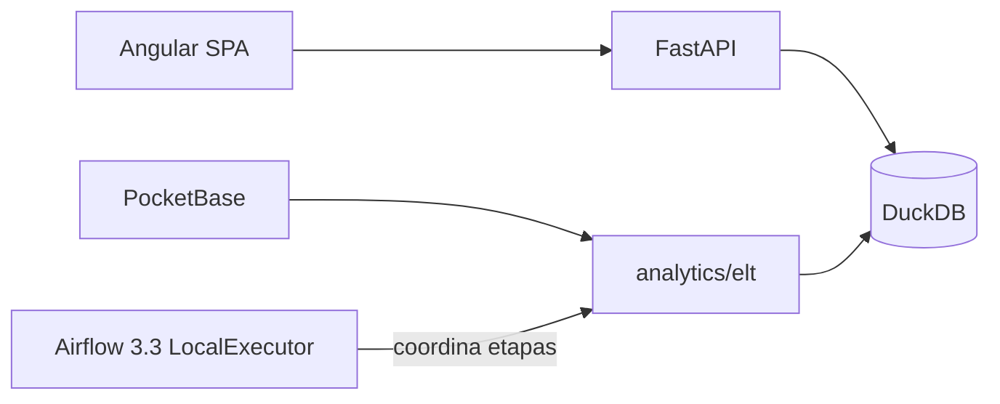

# Voxmetriks

[](https://python.org)
[](https://fastapi.tiangolo.com)
[](https://angular.io)
[](https://duckdb.org)

**Plataforma de catálogo musical + analytics** — SPA Angular, API FastAPI y warehouse DuckDB (Medallion ELT).

**Estado:** aplicación operativa local / despliegue académico controlado. La experiencia visible reproduce únicamente mediante la cuenta Spotify autorizada por el usuario (OAuth PKCE + Web Playback SDK); requiere Spotify Premium y no usa un Client Secret en el navegador.

Tras **spec 014** (estabilización): monorepo `apps/` + `analytics/elt` canónico; dominios técnicos `identity` / `catalog` / `engagement` / `analytics` / `ai` / `platform`.

**Capa empresarial (specs 016–028):** implementada — reporting, CRM, billing (proveedor por defecto `manual_transfer`; `academic_mock` solo fuera de producción), customer success.
**Suscripciones personales B2C (spec 029):** Free / Premium Individual / Duo / Familiar.
Primer admin: `python apps/backend/scripts/bootstrap_admin.py` (`BOOTSTRAP_ADMIN_EMAIL` / `BOOTSTRAP_ADMIN_PASSWORD`). Detalle: [`docs/STATUS.md`](docs/STATUS.md).
Royalties/Payouts: **OUT_OF_SCOPE** (sin transferencias bancarias reales). Specs históricas: [`.specify/history/`](.specify/history/README.md).

---

## Arquitectura (resumen)



| Ruta | Rol | Estado |
|------|-----|--------|
| `apps/frontend` | SPA Angular | **Implementado** |
| `apps/backend` | API FastAPI | **Implementado** |
| `analytics/elt` | Pipeline ELT canónico | **Implementado** |
| `infrastructure/airflow` | Orquestación Airflow 3.3 (LocalExecutor, demo) | **Parcial** — código en repo; runtime pendiente de smoke Docker |
| `apps/backend/app/etl` | Refresh runtime / tests | **Parcial** (adaptador; no rebuild completo) |
| `playback-core` | Dirección futura del player | **Parcial** / propuesto V2 |
| Organizations / CRM / billing / subscriptions | 016–019 | **Implementado** (`PAYMENT_PROVIDER=manual_transfer` por defecto) |
| Artists / catalog-rights / campaigns / biz-analytics | 020–023 | **Implementado** |
| Compliance / platform-ops | 026–027 | **Implementado** |
| Executive Reporting / Decisions | 024 | **IMPLEMENTED** (`/api/v1/reports`, `/business-decisions`) |
| Customer Success / Support | 025 | **IMPLEMENTED** (`/customer-success`, `/support`) |
| Royalties / Payouts | — | **OUT_OF_SCOPE** (futuro; no son 024/025) |

Detalle: [docs/STATUS.md](docs/STATUS.md) · Specs históricas: [.specify/history/](.specify/history/README.md) · ELT: [docs/architecture/elt.md](docs/architecture/elt.md)

---

## Cómo ejecutar

```powershell
# Windows (recomendado)
.\scripts\setup.ps1
# Warehouse: PocketBase + dataset, luego:
#   .\apps\backend\.venv\Scripts\python.exe analytics\elt\pipelines\elt_pipeline.py
# Primer admin:
#   $env:BOOTSTRAP_ADMIN_EMAIL="ops@example.com"
#   $env:BOOTSTRAP_ADMIN_PASSWORD="..."
#   .\apps\backend\.venv\Scripts\python.exe apps\backend\scripts\bootstrap_admin.py
.\scripts\start.ps1
```

```bash
# Dependencias (alternativa)
make install
cd apps/frontend && npm install && cd ../..

# Warehouse (canónico)
make pipeline
# o: python analytics/elt/pipelines/elt_pipeline.py

# API local
make dev
# o: cd apps/backend && uvicorn app.main:app --reload --port 8000

# SPA local
cd apps/frontend && npm start
```

### Docker (comando oficial)

Stack canónico en la raíz (`compose.yml` + `infrastructure/docker/Dockerfile` para backend/ELT + `apps/frontend/Dockerfile`):

```bash
docker compose up --build
```

Equivalente: `make up`. Frontend en `:8080`, API en `:8000` (diagnóstico; el navegador usa Nginx `/api/`).

### Orquestación ELT con Airflow (Spec 048, local/demo)

Stack **separado** en `infrastructure/airflow/compose.yml` (no sustituye el Compose de aplicación). Airflow solo coordina; el ELT autoritativo sigue en `analytics/elt/pipelines/elt_pipeline.py`. **Docker es requerido** para el runtime Airflow; la aceptación exige smoke real (SC-003).

**Mantenimiento DuckDB (single-writer):** detén la app (`make down` / `start.ps1`) antes de disparar el DAG. No ejecutes Airflow y backend contra el mismo warehouse a la vez.

```bash
make down                 # o detener start.ps1
# cp infrastructure/airflow/.env.example → .env y editar placeholders (obligatorio)
make airflow-up           # UI http://localhost:8081 — falla si .env tiene replace-me
make airflow-list         # debe listar voxmetriks_elt
make airflow-trigger      # manual; schedule=None
make airflow-down
make up                   # volver a la aplicación
```

CLI por etapas (mismo adaptador que el DAG): `python analytics/elt/pipelines/orchestrated_pipeline.py <stage>`. Detalle: [docs/architecture/elt.md](docs/architecture/elt.md) · [docs/QUICKSTART.md](docs/QUICKSTART.md).

Guía completa: [docs/QUICKSTART.md](docs/QUICKSTART.md)

### Primer acceso

1. Regístrate en la UI (`/register`) o crea un admin:
   ```powershell
   $env:BOOTSTRAP_ADMIN_EMAIL="ops@example.com"
   $env:BOOTSTRAP_ADMIN_PASSWORD="TuPasswordSeguro12"
   .\apps\backend\.venv\Scripts\python.exe apps\backend\scripts\bootstrap_admin.py
   ```
2. Seeds DEV opcionales: ver `apps/backend/.env.development.example` (nunca en producción).

---

## Tests

```bash
# Backend
cd apps/backend && python -m pytest -q

# Frontend
cd apps/frontend && npm test && npm run lint && npm run build
```

Playwright (`automation/playwright`) y Docker Compose son **opcionales**; no asumir verdes si no se ejecutaron en el entorno.

---

## Specs SDD

Especificaciones: [.specify/history/](.specify/history/README.md)
Spec de estabilización: `.specify/history/014-repository-stabilization-domain-foundation/`

---

## Documentación

**Índice:** [docs/README.md](docs/README.md)

| Documento | Enlace |
|-----------|--------|
| Quickstart | [QUICKSTART.md](docs/QUICKSTART.md) |
| Estado de producto | [STATUS.md](docs/STATUS.md) |
| Modelo de negocio | [BUSINESS-MODEL.md](docs/product/BUSINESS-MODEL.md) |
| API | [api.md](docs/api/api.md) |
| Seguridad | [security.md](docs/security/security.md) |
