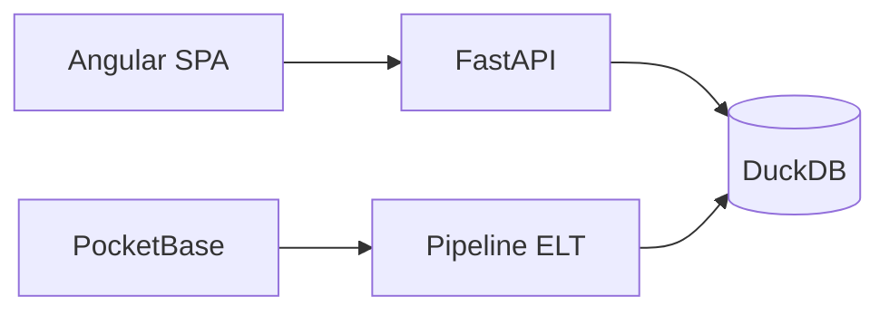

# Voxmetriks

[](https://python.org)
[](https://fastapi.tiangolo.com)
[](https://angular.io)
[](https://duckdb.org)
[](docs/RELEASE_NOTES.md)

**Plataforma de streaming musical con analytics enterprise** — SPA Angular, API FastAPI y warehouse DuckDB (Medallion ELT).

**Estado actual:** [VOXMETRIKS V2 — Release Candidate 1](docs/RELEASE_NOTES.md) (beta privada / demo controlada).

---

## Descripción

Voxmetriks combina experiencia de escucha (catálogo, playlists, reproductor, recomendaciones, IA musical) con un hub analítico alimentado por tablas Gold. Dataset Spotify sintético/warehouse; motor de recomendaciones explicable; IA con fallback local (sin API key obligatoria).

---

## Arquitectura (resumen)



Detalle: [docs/ARCHITECTURE_OVERVIEW.md](docs/ARCHITECTURE_OVERVIEW.md)

---

## Tecnologías

| Capa | Stack |
|------|-------|
| Frontend | Angular 21, RxJS, Material, ECharts |
| Backend | FastAPI, Pydantic v2, Python 3.12 |
| Datos | DuckDB, arquitectura Medallion |
| ELT | Python, Pandas/Polars, PocketBase |
| Tests | pytest, Vitest, Playwright |
| DevOps | Docker Compose, Makefile, GitHub Actions (opcional) |

---

## Cómo ejecutar

```bash
# Con Docker (API)
make up

# Desarrollo local
make install
make pipeline   # warehouse
make dev        # backend :8000
cd apps/frontend && npm install && npm start   # SPA :4200
```

Guía completa: [docs/QUICKSTART.md](docs/QUICKSTART.md)

### Credenciales demo (solo development)

| Usuario | Password | Rol |
|---------|----------|-----|
| `demo` | `demo123` | user |
| `admin` | `admin123` | admin |

---

## Fases del producto

| Fase | Doc |
|------|-----|
| 1 Spotify UX | [PLAYBACK_SPOTIFY_UX_PHASE1.md](docs/PLAYBACK_SPOTIFY_UX_PHASE1.md) |
| 2 Playback Engine | [PLAYBACK_ENGINE_PHASE2.md](docs/PLAYBACK_ENGINE_PHASE2.md) |
| 3 Audio Resolver | [AUDIO_RESOLVER_PHASE3.md](docs/AUDIO_RESOLVER_PHASE3.md) |
| 4 Smart Recommendations | [SMART_RECOMMENDATION_ENGINE_PHASE4.md](docs/SMART_RECOMMENDATION_ENGINE_PHASE4.md) |
| 5 Enterprise Platform | [ENTERPRISE_PLATFORM_PHASE5.md](docs/ENTERPRISE_PLATFORM_PHASE5.md) |
| 6 VOXMETRIKS AI | [VOXMETRIKS_AI_PHASE6.md](docs/VOXMETRIKS_AI_PHASE6.md) |
| 7 Hardening / RC | [FINAL_PRODUCT_AUDIT.md](docs/FINAL_PRODUCT_AUDIT.md) |

---

## Documentación

**Índice:** [docs/README.md](docs/README.md)

| Documento | Enlace |
|-----------|--------|
| Features | [PRODUCT_FEATURES.md](docs/PRODUCT_FEATURES.md) |
| Release Notes RC1 | [RELEASE_NOTES.md](docs/RELEASE_NOTES.md) |
| Roadmap | [ROADMAP.md](docs/ROADMAP.md) |
| Auditoría final | [FINAL_PRODUCT_AUDIT.md](docs/FINAL_PRODUCT_AUDIT.md) |
| API | [api.md](docs/api/api.md) |
| Seguridad | [security.md](docs/security/security.md) |

Especificaciones SDD: [automation/specs/README.md](automation/specs/README.md)
