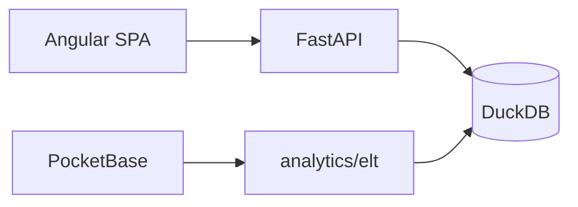

# Voxmetriks

[](https://python.org)
[](https://fastapi.tiangolo.com)
[](https://angular.io)
[](https://duckdb.org)

**Plataforma de catálogo musical + analytics** — SPA Angular, API FastAPI y warehouse DuckDB (Medallion ELT).

**Estado:** demo / beta controlada (Release Candidate documental). No es un servicio de streaming con licencia comercial propia; la reproducción usa YouTube + Audius + audio demo.

Tras **spec 014** (estabilización): monorepo `apps/` + `analytics/elt` canónico; dominios técnicos `identity` / `catalog` / `engagement` / `analytics` / `ai` / `platform` (con adaptadores legacy).

---

## Arquitectura (resumen)



| Ruta | Rol | Estado |
|------|-----|--------|
| `apps/frontend` | SPA Angular | **Implementado** |
| `apps/backend` | API FastAPI | **Implementado** |
| `analytics/elt` | Pipeline ELT canónico | **Implementado** |
| `apps/backend/app/etl` | Refresh runtime / tests | **Parcial** (adaptador; no rebuild completo) |
| `playback-core` | Dirección futura del player | **Parcial** / propuesto V2 |
| Dominios CRM/billing/orgs | — | **No implementado** (fuera de 014) |

Detalle: [docs/ARCHITECTURE_OVERVIEW.md](docs/ARCHITECTURE_OVERVIEW.md) · ELT: [docs/architecture/elt.md](docs/architecture/elt.md) · Playback: [docs/playback/SPEC_014_PHASE_F_DECISION.md](docs/playback/SPEC_014_PHASE_F_DECISION.md)

---

## Cómo ejecutar

```bash
# Dependencias
make install
cd apps/frontend && npm install && cd ../..

# Warehouse (canónico)
make pipeline
# o: python analytics/elt/pipelines/elt_pipeline.py

# API
make dev
# o: cd apps/backend && uvicorn app.main:app --reload --port 8000

# SPA
cd apps/frontend && npm start
```

Guía completa: [docs/QUICKSTART.md](docs/QUICKSTART.md)

### Credenciales demo (solo development)

| Usuario | Password | Rol |
|---------|----------|-----|
| `demo` | `demo123` | user |
| `admin` | `admin123` | admin |

---

## Tests

```bash
# Backend
cd apps/backend && python -m pytest -q

# Frontend
cd apps/frontend && npm test && npm run lint && npm run build
```

Playwright (`automation/playwright`) y Docker Compose son **opcionales**; no asumir verdes si no se ejecutaron en el entorno.

---

## Specs SDD

Especificaciones: [automation/specs/](automation/specs/README.md)  
Spec de estabilización: `automation/specs/014-repository-stabilization-domain-foundation/`

---

## Documentación

**Índice:** [docs/README.md](docs/README.md)

| Documento | Enlace |
|-----------|--------|
| Quickstart | [QUICKSTART.md](docs/QUICKSTART.md) |
| Features | [PRODUCT_FEATURES.md](docs/PRODUCT_FEATURES.md) |
| Release Notes | [RELEASE_NOTES.md](docs/RELEASE_NOTES.md) |
| API | [api.md](docs/api/api.md) |
| Seguridad | [security.md](docs/security/security.md) |
