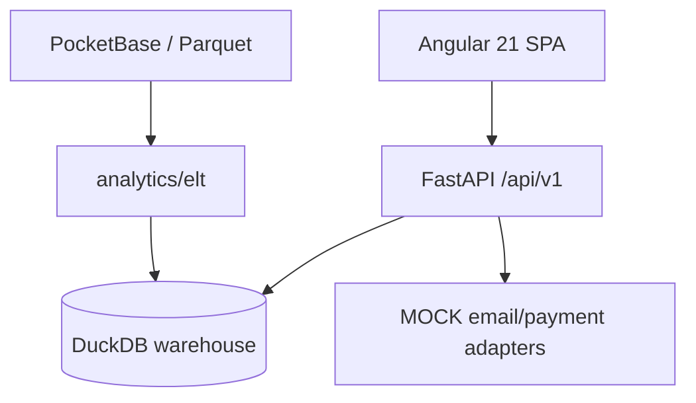

# Architecture As Implemented — Spec 028

**Date:** 2026-07-12  
**Status:** As-built snapshot at enterprise closure

## Topology

## Layering

| Layer | Location | Notes |
|-------|----------|-------|
| Enterprise facade | `app/api/enterprise_router.py` | Dashboard, analytics, tracks, users |
| Domain packages | `app/packages/*` | 016–023, 026, 027 |
| Platform jobs | `app/platform/jobs` | Scheduler; reused by platform_ops |
| ELT | `analytics/elt` | Canonical Medallion pipeline |
| Runtime ETL | `apps/backend/app/etl` | Partial refresh adapter |

## API surface (`/api/v1`)

| Domain | Prefix | Package |
|--------|--------|---------|
| Identity | `/users` | `identity` |
| Organizations | `/organizations` | `organizations` |
| CRM | `/crm` | `crm` |
| Contracts | `/contracts` | `contracts` |
| Plans | `/plans` | `subscriptions` |
| Subscriptions | `/subscriptions` | `subscriptions` |
| Billing | `/billing` | `billing` |
| Artists (business) | `/artists` | `artists` |
| Catalog rights | `/catalog-rights` | `catalog_rights` |
| Campaigns | `/campaigns` | `campaigns` |
| Business analytics | `/business-analytics` | `business_analytics` |
| Compliance | `/compliance` | `compliance` |
| Platform ops | `/platform-ops` | `platform_ops` |
| Streaming catalog | `/tracks`, `/catalog/artists`, etc. | `catalog`, `engagement` |

## Not registered (deferred / absent)

- `/api/v1/support` — designed 015, not built
- `/api/v1/customer-success` — designed 015, not built
- `/api/v1/reporting/reports` — designed 015, not built
- Royalties / Payouts — specs 024/025 NOT_PRESENT

## Frontend

Angular packages mirror backend domains under `apps/frontend/src/app/packages/`. Navigation in `dashboard-layout.component.ts` includes enterprise sections (orgs, CRM, subscriptions, billing, artists, catalog-rights, campaigns, business-analytics, compliance, platform-ops).

## Data store

Single-file DuckDB (`data/warehouse/voxmetrik.duckdb`). App tables (`app_*`) coexist with warehouse dims/facts. Academic limits: no HA, no multi-tenant isolation at DB level beyond application RBAC.

## Integration points

- Billing `PaymentProvider` → platform_ops webhooks (MOCK)
- Campaign ROI → business_analytics KPIs (warehouse streams)
- Subscriptions orchestration → billing past-due notifications
- Organizations `X-Organization-Id` header for org-scoped APIs
