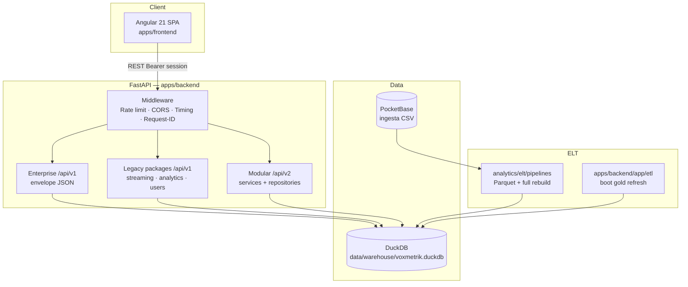
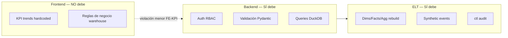

# VOXMETRIKS — Auditoría de Arquitectura Enterprise (Fase 3)

**Fecha:** 2026-07-05  
**Rol:** Principal Software Architect — gate de producción  
**Alcance:** Frontend Angular, Backend FastAPI, DuckDB, ELT Medallion, PocketBase, seguridad, rendimiento, deuda técnica  
**Estado:** Solo documentación. **No se implementaron correcciones.**

**Auditorías relacionadas:** [FUNCTIONAL_AUDIT.md](./FUNCTIONAL_AUDIT.md) · [UX_UI_AUDIT.md](./UX_UI_AUDIT.md)

---

## Veredicto de producción

| Dimensión | Estado | Nota |
|-----------|--------|------|
| Mantenibilidad | ⚠️ Condicional | Tres capas API + dual ELT aumentan costo de cambio |
| Escalabilidad | ⚠️ Condicional | Rate limit in-memory; DuckDB single-file |
| Consistencia | ❌ Bloqueos puntuales | Schema `skip_rate`/`skip_count`; typo `id_genre` |
| Testabilidad | ✅ Aceptable | pytest + Playwright 45/45 (según README) |
| Seguridad | ⚠️ Condicional | Auth sólida en catálogo; analytics/explorer parcialmente públicos |
| Documentación | ✅ Buena base | Arquitectura documentada; algunos desfaces con código |
| Evolución sin reescritura | ✅ Sí | Monorepo estable; prohibido reorg masivo innecesario |

**Conclusión:** El proyecto **puede desplegarse en producción controlada (demo/staging enterprise)** tras resolver **3 bloqueadores críticos** y documentar deuda dual-stack. **No recomendado** producción multi-tenant de alto tráfico sin hardening adicional (auth V2, rate limit distribuido, schema contract tests).

---

## Arquitectura actual

### Vista de sistema



### Monorepo (estable — no reorganizar)

```
voxmetriks/
├── apps/
│   ├── frontend/          # Angular 21 SPA
│   └── backend/           # FastAPI + ETL interno
├── analytics/elt/         # Pipeline Medallion principal (PocketBase → DuckDB)
├── data/warehouse/        # DuckDB (gitignored)
├── infrastructure/        # Docker, PocketBase, Makefile, .env.example
├── automation/            # E2E Playwright, specs SDD, scripts smoke
├── docs/                  # Arquitectura, API, testing
└── archive/               # Legacy congelado
```

### Frontend — capas

| Capa | Responsabilidad | Riesgo arquitectónico |
|------|-----------------|----------------------|
| `core/` | Auth, interceptors, guards, `ApiService` enterprise, i18n | Bajo |
| `features/` | 4 pantallas enterprise (`dashboard`, `analytics`, `tracks`) | Medio — depende de `packages/analytics` fallback |
| `packages/` | Dominios producto (streaming, analytics legacy, data-engineering) | Medio — mayor superficie |
| `shared/` | UI reutilizable, player, modelos compartidos | Bajo |
| `layouts/` | Shell autenticado + auth | Bajo |

**Estado:** Standalone components, lazy loading en **25 rutas** (`loadComponent`), sin NgModules. Sin NgRx — signals + RxJS híbrido.

### Backend — capas

| Capa | Ubicación | Patrón |
|------|-----------|--------|
| Routers enterprise | `app/api/routes/*`, `enterprise_router.py` | Envelope `{status, data, meta}` |
| Routers legacy | `app/packages/*/routes/` | Dict / modelos propios |
| Routers V2 | `app/api/router.py` | Pydantic typed |
| Services V2 | `app/services/` | Dominio + cache in-process |
| Services legacy | `app/packages/*/services/` | SQL directo o helpers |
| Repositories | `app/repositories/` | Solo V2/enterprise |
| DuckDB access | 3 vías: `DuckDBClient`, `core/database.py`, legacy `get_conn()` | **Deuda media** |

### Datos — Medallion

| Layer | Tablas ejemplo | Origen |
|-------|----------------|--------|
| Bronze | `raw_spotify`, `bronze_raw_tracks` | PocketBase CSV / Parquet |
| Silver | `silver_tracks`, `silver_streams` | Transform in-DB o Parquet |
| Gold dims | `dim_track`, `dim_artista`, `dim_genero`, `dim_album`, … | ETL |
| Gold facts | `fact_streaming`, `fact_searches`, … | ETL + sintéticos enterprise |
| Gold agg | `agg_daily_streams`, `agg_tracks_populares`, `agg_dashboard_cache`, … | Builders |
| Control | `ctl_carga_dataset`, `ctl_pipeline_stages` | Auditoría pipeline |
| App runtime | `app_user`, `app_session`, `app_favorite`, … | API (no ELT) |

---

## Frontend — auditoría detallada

### Routing

| Aspecto | Estado | Detalle |
|---------|--------|---------|
| Lazy loading | ✅ | 25 `loadComponent`; layouts eager |
| Guards | ✅ | `authGuard`, `guestGuard`, `engineerGuard` |
| Redirects | ⚠️ | `dashboard/analytics` → `/analytics` (legacy), no `/insights/analytics` |
| Fallback | ✅ | `not-found` dentro layout; root `**` → discover |
| Breadcrumbs | ❌ | No implementados (resolvers ausentes) |
| Rutas muertas | ⚠️ | `features/users` sin ruta (`insights/users` → `/users` package) |

### Interceptors (orden en `app.config.ts`)

1. `loadingInterceptor` — barra global  
2. `apiInterceptor` — Bearer en `/api/v1`  
3. `authErrorInterceptor` — 401 → logout  
4. `catalogStewardInterceptor` — mutaciones catálogo solo admin  

**Evaluación:** Orden correcto; separación de concerns clara ✅

### Servicios duplicados (nombres colisionantes)

| Nombre | Instancia A | Instancia B | Riesgo |
|--------|-------------|-------------|--------|
| DashboardService | `core/services/dashboard.service.ts` → enterprise API | `packages/streaming/services/dashboard.service.ts` → `/dashboard/home` | 🟠 Confusión DI/import |
| Tracks | `EnterpriseTracksService` (`core/`) | `TracksService` (`packages/streaming/`) | 🟡 Diferente propósito, nombre confuso |
| Users | `EnterpriseUsersService` | `UserService` (auth/profile) | 🟡 |

**Corrección propuesta:** Renombrar clases (no carpetas): `EnterpriseDashboardService`, `CatalogTracksService` — **beneficio claridad**, **riesgo bajo**, **esfuerzo 2h**.

### Componentes grandes (>300 LOC TS)

| LOC | Archivo | ¿Dividir? |
|-----|---------|-----------|
| 497 | `elt-pipeline.component.ts` | 🟡 Solo si se extrae sub-widgets; no urgente |
| 311 | `users.component.ts` | 🟡 |
| 267 | `home.component.ts` | 🟡 Ya parcialmente widgetizado |
| 252 | `dashboard-layout.component.ts` | 🟢 Nav config justifica tamaño |

**Regla aplicada:** No dividir sin beneficio de mantenimiento medible.

### State management

- **Signals:** UI state, auth, player (moderno)  
- **RxJS:** HTTP, `HistoryService` subjects  
- **Sin store global** — adecuado para escala actual ✅  
- **Deprecated:** `MusicPlayerService` BehaviorSubject legacy — migrar callers 🟡

### Código muerto / huérfano (frontend)

| Item | Evidencia | Acción recomendada |
|------|-----------|-------------------|
| `features/users/users.component.ts` | Sin ruta | Eliminar o conectar ruta |
| `src/app.config.ts` (stub) | No usado por `main.ts` | Eliminar |
| `console.log` | 0 ocurrencias | ✅ |
| TODO/FIXME | 0 | ✅ |
| `console.error` | ~18 en handlers | ✅ Aceptable |

### Dependencias npm

- Angular 21, RxJS 7.8, ECharts 6, Material 21 (uso parcial)  
- Sin NgRx — lean ✅  
- **Observación:** `@angular/material` completo con uso mínimo — revisar bundle 🟡 PERF-FE-01

---

## Backend — auditoría detallada

### Superficie API (resumen)

| Prefijo | Capas | Contratos |
|---------|-------|-----------|
| `/api/v1` | Enterprise + Legacy | **Mezclados** — paths distintos, shapes distintos |
| `/api/v2` | Modular | Pydantic models |
| `/health` | Root | Público |

**Endpoints ambiguos (mismo dominio, distintas rutas):**

| Dominio | Enterprise | Legacy | V2 |
|---------|------------|--------|-----|
| Dashboard | `/dashboard/overview` | `/dashboard/home` | `/dashboard/overview` |
| Top tracks | `/tracks/top` | `/stats/top-tracks`, `/analytics/trending` | `/analytics/top-tracks` |
| Recommendations | `/tracks/recommendations/{id}` | `/analytics/recommendations` | `/recommendations/{user_id}` |
| Streams analytics | `/analytics/streams` | `/analytics/engagement` | `/analytics/daily-streams` |

**Hallazgo 🔴 API-01:** Tres implementaciones de recomendaciones; contratos no unificados. **No consolidar ahora** — documentar mapa de deprecación.

### Lógica de negocio — ubicación

| Regla | Cumplimiento |
|-------|--------------|
| Router delgado | ⚠️ Legacy routes con SQL ocasional |
| Servicio = reglas | ✅ Mayoría |
| Repositorio = queries | ✅ V2/enterprise |
| No duplicar reglas FE/BE | ⚠️ KPI trends hardcoded en FE (`home-metrics.util.ts`) — violación menor |

### Bug confirmado — mutaciones catálogo

```python
# apps/backend/app/packages/streaming/services/tracks/mutations.py:125
params.append(id_genre)  # NameError — debe ser id_genero
```

**Prioridad 🔴 BE-01** · **Riesgo:** fallo en runtime al actualizar género de track · **Esfuerzo:** 5 min · **Beneficio:** CRUD estable

### Schema mismatch — `agg_daily_streams`

| Fuente | Columna |
|--------|---------|
| `analytics/elt/.../enterprise_analytics.py` | `skip_count INTEGER` |
| `apps/backend/app/etl/gold/metrics_daily.py` | `skip_rate DOUBLE` |
| `dashboard_service.py`, cache warm | Lee `skip_rate` |
| `enterprise_analytics_service.py`, trending SQL | Lee `skip_count` |
| `streams_by_date_range.sql` | `skip_count` |

**Prioridad 🔴 DB-01** · Impacto: dashboard vacío, cache warm falla, KPIs inconsistentes · Documentado en logs boot.

**Corrección propuesta (elegir una):**
- **Opción A (recomendada):** Tabla con **ambas columnas** + migración `ADD COLUMN IF NOT EXISTS`; builders poblan ambas  
- **Opción B:** Vista `agg_daily_streams_v` unificada  
- **Riesgo:** Medio si no se testea contra warehouse real · **Esfuerzo:** 4–8h · **Beneficio:** Elimina clase entera de fallos 503

### DuckDB — acceso (3 abstracciones)

1. `DuckDBClient` singleton (V2, read-only validated)  
2. `core/database.py` pool read/write  
3. Legacy `Depends(get_conn)`  

**Deuda 🟠 DB-02:** Mantener las 3 es costoso pero **no fusionar sin plan** — nueva código debe usar `DuckDBClient` + repositories.

### Logging dual

- **Activo:** `app/core/logging.py`  
- **Legacy:** `app/core/logger.py` (no usado en startup)  

**Corrección 🟡 OBS-01:** Deprecar `logger.py` en docstring; no borrar hasta verificar imports.

### Tests backend

Cobertura en: auth, RBAC explorer, dashboard, orchestrator, smoke regression, cover art, data validation.

**Gap 🟡 TEST-01:** No hay test de contrato schema `agg_daily_streams` post-ELT.

---

## ELT — auditoría

### Dos pipelines (coexistencia documentada)

| Pipeline | Trigger | Alcance |
|----------|---------|---------|
| `analytics/elt/pipelines/elt_pipeline.py` | `make pipeline`, POST `/stats/import` | Full: PB → Parquet → DuckDB + enterprise synthetic |
| `apps/backend/app/etl/` | `RUN_ETL_ON_BOOT=auto` | In-warehouse bronze→silver→gold refresh |

**Idempotencia:** DELETE+INSERT dims/facts; `CREATE IF NOT EXISTS`; stage registry en `ctl_pipeline_stages` ✅

**No idempotente:** `import_from_pocketbase.py` borra warehouse antes de import 🟠 ELT-01

### Orchestrator path (local dev)

- Busca `{root}/elt/pipelines/elt_pipeline.py`  
- Código real: `analytics/elt/pipelines/elt_pipeline.py`  
- Docker: OK (`/app/elt/`)  

**Prioridad 🟠 ELT-02** · **Esfuerzo:** 1h · **Beneficio:** Boot local consistente

### PocketBase

- **Rol:** Solo ingesta CSV catálogo — **no auth app** ✅  
- **Colección:** `datasets`  
- **Seguridad:** Credenciales vía env; no en repo ✅  
- **Fragilidad:** Detección de campo CSV por suffix `.csv` en keys 🟡

---

## Seguridad

| Control | Implementación | Gap |
|---------|----------------|-----|
| Autenticación | Session UUID en `app_session`, Bearer header | ✅ |
| JWT | No usado | N/A — decisión válida |
| Passwords | bcrypt + upgrade desde SHA256 legacy | ✅ |
| CORS | Configurable; `*` solo dev | ✅ |
| Rate limit | In-memory IP buckets (120/min global, 20/min auth) | 🟠 No multi-instance |
| Headers seguridad | HSTS prod, X-Frame-Options, etc. | ✅ |
| SQL injection | Validación read-only client; explorer blocked columns | ✅ |
| XSS | Angular sanitization + headers | ✅ |
| CSRF | SPA Bearer — bajo riesgo | ✅ |
| Secrets | `.env.example`; defaults `change-me-in-production` | 🟡 Validar en prod |
| RBAC | engineer/admin en explorer, import, synthetic | ✅ |
| Endpoints públicos | Muchos `/analytics/*`, `/stats/*` sin auth | 🟠 SEC-01 — OK demo, no OK multi-tenant |

**Hallazgo 🟠 SEC-02:** `SECRET_KEY` definido pero sesiones no firmadas — documentar que auth es DB-backed, no JWT.

---

## Rendimiento

| Área | Evidencia | Acción |
|------|-----------|--------|
| DuckDB read pool | Implementado | ✅ |
| Cache in-process | TTL por dominio en V2 | ✅ single-node |
| N+1 HTTP | `audio-features` carga 6× `getTrackDetail` secuencial | 🟡 PERF-01 — batch endpoint futuro |
| Paginación API | Server-side en catálogo | ✅ |
| Frontend bundle | ECharts modular; Material parcial | 🟡 Analizar budget |
| Imágenes | Lazy load covers | ✅ |
| `@defer on viewport` Home | ✅ | Buena práctica |

**Regla:** No optimizar prematuramente — N+1 en audio-features es evidencia concreta, prioridad media.

---

## Observabilidad

| Capacidad | Estado |
|-----------|--------|
| Request ID | ✅ `X-Request-ID` |
| Timing | ✅ `X-Response-Time-Ms` |
| Logs rotativos | ✅ api.log, errors.log, database.log |
| JSON logs | ✅ opcional `LOG_JSON` |
| Pipeline stages | ✅ `ctl_pipeline_stages` |
| Métricas Prometheus | ❌ No implementado |
| Trazas distribuidas | ❌ N/A single process |

**Excepciones silenciosas:** `audio-features` catch skip en loop — intencional 🟢; verificar que no oculte errores sistemáticos 🟡

---

## Documentación

| Documento | Estado | Desfase |
|-----------|--------|---------|
| `README.md` | ✅ | E2E 45/45 badge |
| `docs/architecture/architecture.md` | ✅ | Menciona 3 routers — alineado |
| `docs/quickstart.md` | Referenciado | — |
| `docs/database/database.md` | ⚠️ | Documenta `skip_count`; dashboard usa `skip_rate` |
| `.env.example` | ✅ backend + infrastructure | — |
| OpenAPI/Swagger | ✅ dev; off prod | — |
| FUNCTIONAL + UX audits | ✅ Fase 1–2 | — |

**Acción 🟡 DOC-01:** Actualizar `database.md` tras resolver DB-01.

---

## Dependencias

### Python (`requirements.txt`)

FastAPI 0.111, DuckDB 1.1.3, Pydantic 2.7, pandas/polars/pyarrow, bcrypt, httpx, yt-dlp.

- Sin JWT/Redis/SQLAlchemy — coherente con arquitectura ✅  
- `pyproject.toml` solo Ruff/pytest — **requirements.txt es source of truth** ✅

### npm (`apps/frontend/package.json`)

Angular 21, ECharts 6, Material 21 — sin duplicados de framework ✅

**Política:** No bump versiones sin CVE o necesidad — **aceptado** ✅

---

## Deuda técnica — registro clasificado

### 🔴 Alta (bloquea producción seria)

| ID | Descripción | Costo mant. | Riesgo | Impacto | Propuesta | Esfuerzo | Beneficio |
|----|-------------|-------------|--------|---------|-----------|----------|-----------|
| DB-01 | `skip_rate` vs `skip_count` | Alto | Alto | Dashboard 503, KPIs rotos | Unificar schema + migration | 4–8h | Estabilidad datos |
| BE-01 | Typo `id_genre` en mutations | Bajo | Alto | CRUD género roto | Fix variable | 5min | CRUD correcto |
| API-01 | 3× recommendations + analytics paths | Muy alto | Medio | Confusión FE/BE/tests | Mapa deprecación + contrato único a largo plazo | Doc now; code Q+ | Evolución sin ruptura |

### 🟠 Media (afecta evolución)

| ID | Descripción | Propuesta | Esfuerzo |
|----|-------------|-----------|----------|
| FE-DUP-01 | Servicios mismo nombre distintas capas | Renombrar clases enterprise/catalog | 2h |
| FE-ORPH-01 | `features/users` huérfano | Eliminar o rutear | 1h |
| DB-02 | 3 abstracciones DuckDB | Guideline: nuevo código → DuckDBClient | Doc |
| ELT-02 | Orchestrator path local | Apuntar a `analytics/elt/` | 1h |
| ELT-01 | Import borra warehouse | Backup obligatorio + flag `--force` | 2h |
| SEC-01 | Analytics públicos | Auth opcional por env `PUBLIC_ANALYTICS=0` | 4h |
| SEC-03 | Rate limit in-memory | Redis solo si multi-replica | 8h+ |
| LOG-01 | Dual logging modules | Deprecar logger.py | 1h |
| TEST-01 | Sin contract test schema post-ELT | pytest fixture warehouse | 4h |
| REDIR-01 | `dashboard/analytics` redirect incorrecto | → `/insights/analytics` | 15min |

### 🟢 Baja (backlog)

| ID | Descripción |
|----|-------------|
| PERF-FE-01 | Material bundle size |
| PERF-01 | Batch audio-features |
| OBS-02 | Métricas Prometheus |
| FE-DEP-01 | Remover BehaviorSubject deprecated player |
| DOC-01 | Sync database.md |
| DEAD-01 | `drop_big_table.py` path obsoleto |
| DEAD-02 | `src/app.config.ts` stub |

---

## Cambios recomendados (Fase 4 — cuando se autorice)

| # | Cambio | Justificación técnica | Riesgo | Esfuerzo |
|---|--------|----------------------|--------|----------|
| 1 | Fix `id_genre` → `id_genero` | Bug runtime confirmado | Mínimo | 5 min |
| 2 | Unificar `agg_daily_streams` schema | Evidencia en logs + tests + ELT | Medio | 4–8h |
| 3 | Contract test schema gold | Previene regresión DB-01 | Bajo | 4h |
| 4 | Fix orchestrator ELT path | Boot local ≠ Docker | Bajo | 1h |
| 5 | Renombrar servicios FE duplicados | Reduce errores import | Bajo | 2h |
| 6 | Eliminar/rutear `features/users` | Código muerto confirmado | Bajo | 1h |
| 7 | Redirect `dashboard/analytics` | Coherencia routing | Mínimo | 15 min |
| 8 | Documentar mapa API v1/v2/legacy | Onboarding arquitectos | Ninguno | 2h |

**Validación obligatoria post-cambio:** Docker up · pytest · Playwright · ELT pipeline · frontend build.

---

## Cambios descartados (con justificación)

| Cambio propuesto | Motivo descarte |
|------------------|-----------------|
| Reorganizar carpetas monorepo | Estable post-migración enterprise; costo >> beneficio |
| Migrar todo a `/api/v2` de golpe | Rompe frontend legacy + contratos; requiere programa multi-sprint |
| Eliminar `packages/` legacy frontend | Producto activo (home, catálogo, trending); duplicación gestionable |
| Reemplazar DuckDB por Postgres | Fuera de scope; Medallion funciona |
| Reemplazar FastAPI / Angular | Prohibido sin razón objetiva |
| Consolidar ELT en un solo pipeline ya | Dos paths tienen roles (full import vs boot refresh); documentar, no fusionar ahora |
| Redis cache global | Sin evidencia multi-instance hoy |
| Refactor masivo componentes grandes | Sin métrica de pain; home ya widgetizado |
| JWT sobre sessions | Sessions DB funcionan; cambio no justificado |
| Actualizar dependencias major | Sin CVE críticos reportados |

---

## Matriz de responsabilidades por módulo

| Módulo | Responsabilidad única | Clara |
|--------|----------------------|-------|
| `core/ApiService` | Unwrap enterprise envelope | ✅ |
| `packages/streaming` | Catálogo UX + BFF home | ✅ |
| `features/*` | Enterprise insights hub | ⚠️ Fallback a StatsService |
| `app/services/` V2 | Dominio modular API v2 | ✅ |
| `app/packages/` legacy | CRUD + BFF histórico | ⚠️ Solapa V2 |
| `analytics/elt` | Ingesta externa | ✅ |
| `app/etl` | Refresh in-process | ✅ |
| PocketBase | Source CSV only | ✅ |

---

## Separación FE / BE / ELT



**Violación conocida:** `KPI_TRENDS` hardcoded en frontend — mover cálculo a `/dashboard/home` o quitar (ver FUNCTIONAL KPI-01).

---

## Criterios de éxito — evaluación

| Criterio | ¿Cumple? |
|----------|----------|
| Cada módulo con responsabilidad clara | ⚠️ Parcial — solapamiento analytics |
| Sin duplicación innecesaria | ❌ API y servicios duplicados (gestionado) |
| Separación FE/BE/ELT consistente | ✅ Con excepciones menores |
| Contratos API estables | ⚠️ Múltiples shapes; paths estables |
| DB integridad y coherencia | ❌ Hasta fix DB-01 |
| Deuda crítica identificada | ✅ Este documento |
| Documentación refleja sistema | ⚠️ database.md desfasado |
| Evolución sin reestructuración total | ✅ |

---

## Plan de acción pre-producción (mínimo viable)

```
Semana 0 (bloqueadores)
├── DB-01  Unificar agg_daily_streams
├── BE-01  Fix id_genre
└── TEST-01 Contract test schema

Semana 1 (hardening)
├── ELT-02 Orchestrator path
├── REDIR-01 Redirect analytics
├── FE-ORPH-01 Limpiar features/users
└── DOC-01 Actualizar database.md

Backlog (sin fecha)
├── API-01 Programa convergencia API (por dominio)
├── SEC-01 Auth analytics configurable
├── FE-DUP-01 Renombrar servicios
└── OBS-02 Métricas (si SLA lo exige)
```

---

## Anexo — inventario endpoints (referencia)

Ver exploración completa en subagentes. Conteos:

- **Enterprise V1:** ~7 rutas dedicadas  
- **Legacy V1:** ~60+ rutas (streaming + analytics + users)  
- **V2:** ~25 rutas  

Frontend consume principalmente **Legacy V1** (`/api/v1/...`) + **Enterprise V1** (`/dashboard/overview`, `/tracks/top`, etc.). **V2 no expuesto en UI** — superficie preparatoria ✅

---

## Anexo — archivos críticos

| Área | Path |
|------|------|
| Backend entry | `apps/backend/app/main.py` |
| Config | `apps/backend/app/core/config.py` |
| DuckDB client | `apps/backend/app/db/duckdb_client.py` |
| Gold metrics | `apps/backend/app/etl/gold/metrics_daily.py` |
| Enterprise ELT | `analytics/elt/transform/enterprise_analytics.py` |
| Track mutation bug | `apps/backend/app/packages/streaming/services/tracks/mutations.py` |
| Frontend routes | `apps/frontend/src/app/app.routes.ts` |
| Enterprise API | `apps/frontend/src/app/core/services/api.service.ts` |
| Docker | `infrastructure/docker/docker-compose.yml` |
| Arquitectura doc | `docs/architecture/architecture.md` |

---

*Documento generado en Fase 3. Sin cambios de código. Gate de producción: **aprobación condicional** pending DB-01, BE-01, TEST-01.*
