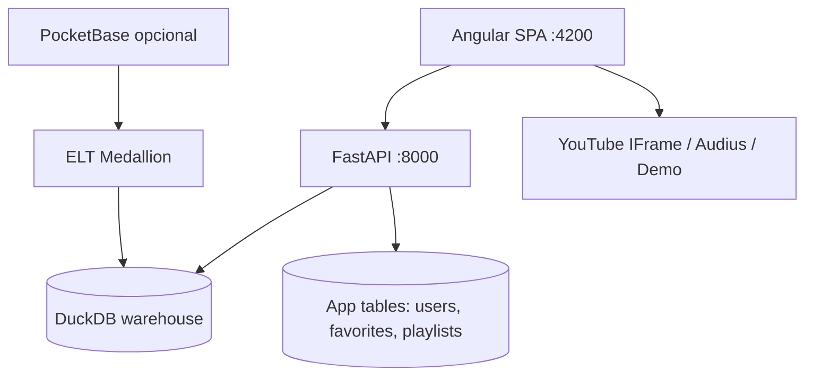

# VOXMETRIKS — Architecture Overview

**Producto:** VOXMETRIKS V2 — Release Candidate 1  
**Fecha:** 2026-07-10  
**Estado:** Beta privada / demo pública controlada

---

## Resumen

VOXMETRIKS es una plataforma de streaming musical con analytics enterprise. Combina experiencia de escucha (catálogo, reproducción, playlists, recomendaciones, IA musical) con un warehouse DuckDB Medallion y dashboards operativos.

---

## Monorepo

| Ruta | Rol | Estado |
|------|-----|--------|
| `apps/frontend` | SPA Angular 21 | Implementado |
| `apps/backend` | API FastAPI + dominios | Implementado |
| `apps/backend/app/packages/{identity,catalog,engagement,analytics,ai}` | Package-by-domain | Implementado (+ shims legacy) |
| `analytics/elt` | Pipeline ELT **canónico** | Implementado |
| `apps/backend/app/etl` | Refresh runtime / tests | Parcial (adaptador) |
| `data/warehouse` | DuckDB (`voxmetrik.duckdb`) | Implementado |
| `infrastructure/docker` | Compose + Dockerfile | Implementado (validación Docker = entorno-dependiente) |
| `automation/` | Specs SDD, Playwright, scripts | Implementado / Playwright opcional |
| `docs/` | Documentación de producto | Implementado |
| `playback-core` (FE) | Dirección futura del player | Parcial — ver [playback/SPEC_014_PHASE_F_DECISION.md](playback/SPEC_014_PHASE_F_DECISION.md) |

---

## Capas de producto (Fases 1–6)

| Fase | Capacidad | Ubicación principal |
|------|-----------|---------------------|
| 1 | Spotify UX Core (favoritos, cola, acciones) | `playback-core/`, track actions |
| 2 | Playback Engine | `music-player.service`, session storage |
| 3 | Audio Resolver multiproveedor | `packages/streaming/services/audio/` |
| 4 | Smart Recommendations | `packages/analytics/services/smart/` |
| 5 | Enterprise Platform | `app/platform/` |
| 6 | VOXMETRIKS AI | `app/packages/ai/` |

**Principio:** reproducción ≠ recomendaciones ≠ IA ≠ analytics. Módulos desacoplados.

---

## API

| Prefijo | Uso |
|---------|-----|
| `/api/v1` | API principal (streaming, auth, smart, AI, platform, analytics) |
| `/api/v2` | Capa modular legacy/enterprise (compatibilidad; FE usa v1) |
| `/health` | Health check público |
| `/docs` | Swagger (solo fuera de production) |

---

## Datos

- **Warehouse:** dimensiones (`dim_*`), hechos (`fact_*`), agregados Gold (`agg_*`)
- **App runtime:** usuarios, sesiones, favoritos, playlists, historial, audio sources
- **ELT:** boot opcional (`RUN_ETL_ON_BOOT`) o `make pipeline`

---

## Seguridad (resumen)

- Roles: `user` / `engineer` / `admin`
- CORS por entorno; wildcard bloqueado en production
- Rate limits globales + auth
- Explorer: solo lectura + ACL engineer
- AI: sanitizer antes de LLM externo; fallback local sin API key
- Seeds demo desactivados en `ENVIRONMENT=production`

Detalle: [security/security.md](security/security.md)

---

## Documentación relacionada

- [PRODUCT_FEATURES.md](PRODUCT_FEATURES.md)
- [RELEASE_NOTES.md](RELEASE_NOTES.md)
- [ROADMAP.md](ROADMAP.md)
- [FINAL_PRODUCT_AUDIT.md](FINAL_PRODUCT_AUDIT.md)
- Fases: `PLAYBACK_*`, `SMART_*`, `ENTERPRISE_*`, `VOXMETRIKS_AI_*`
