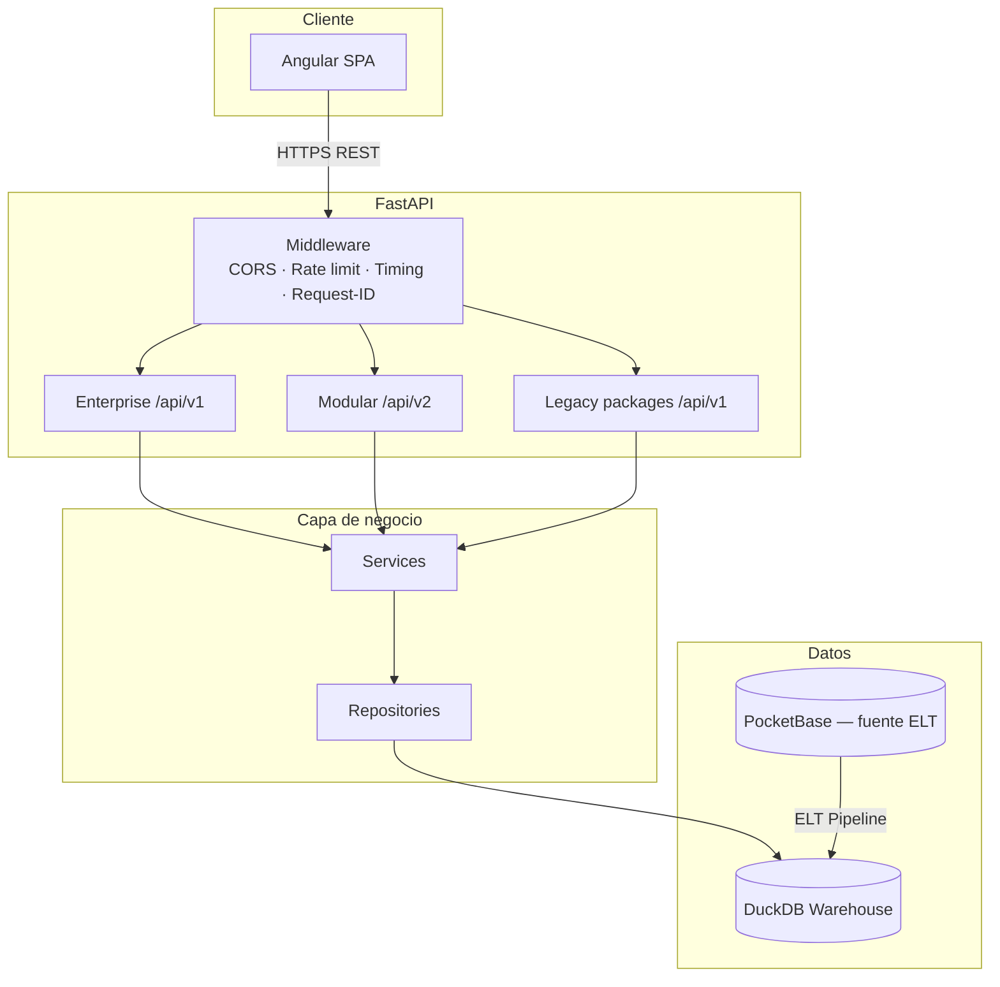
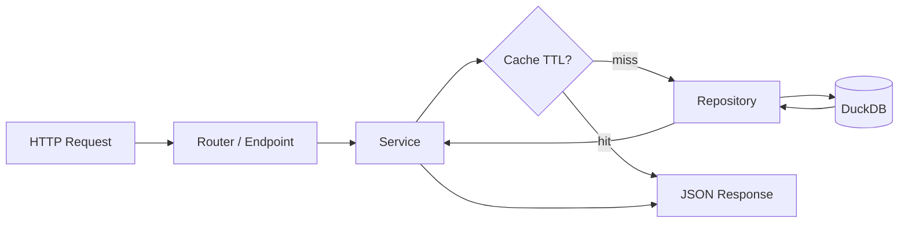
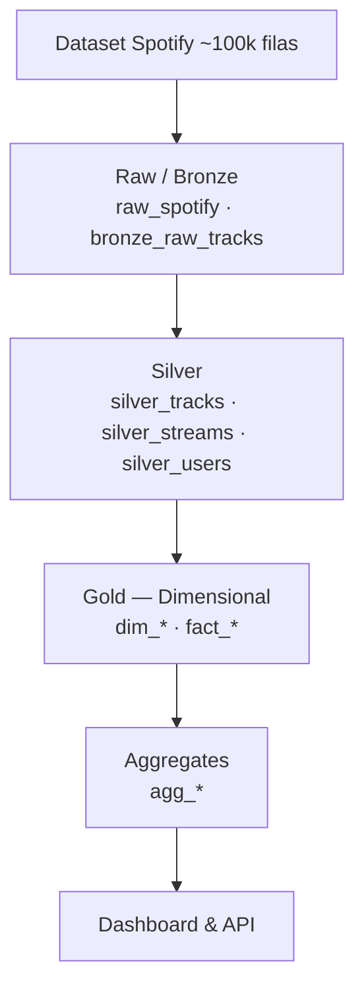
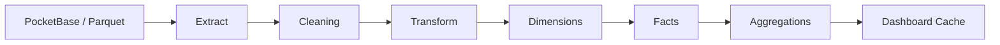
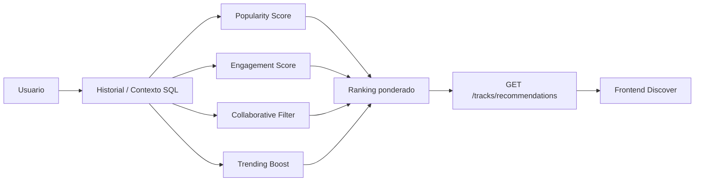
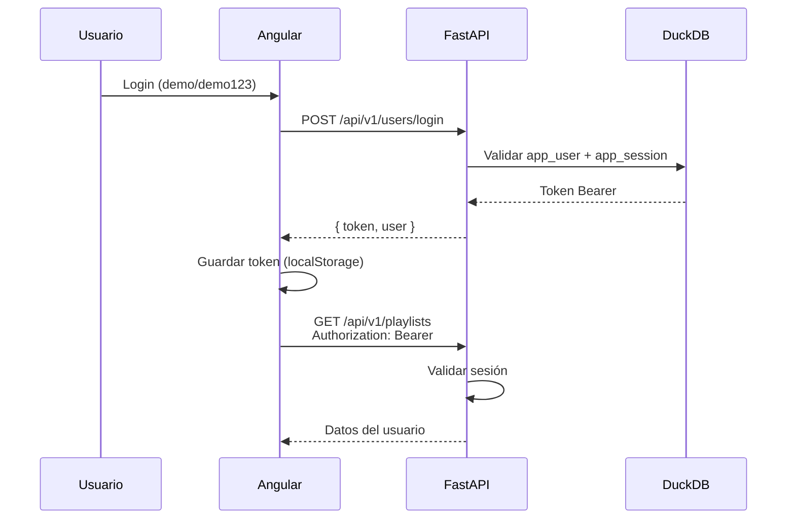

# Arquitectura — VOXMETRIK_V2

## Visión general

VOXMETRIK_V2 es una plataforma de analítica musical tipo Spotify: frontend Angular, API FastAPI y warehouse analítico DuckDB con arquitectura Medallion (Bronze / Silver / Gold). El sistema separa claramente **experiencia de usuario**, **lógica de negocio**, **acceso a datos** y **capa analítica**.

## Diagrama de arquitectura general

## Flujo de capas backend

## Arquitectura Medallion

## Flujo ETL

## Motor de recomendaciones

## Autenticación

## Superficies API

| Superficie | Prefijo | Propósito |
|------------|---------|-----------|
| Enterprise | `/api/v1` | Dashboard, analytics, top tracks, recomendaciones, user insights |
| Modular V2 | `/api/v2` | Servicios de dominio desacoplados (streaming, search, dashboard) |
| Legacy packages | `/api/v1` | Catálogo, auth, playlists, favoritos, stats, explorer |
| Health | `/health`, `/api/v1/health` | Estado del warehouse y ETL |

## Principios de diseño

1. **Single warehouse authority** — Un único DuckDB canónico en `data/warehouse/voxmetrik.duckdb`.
2. **ELT-before-API** — El warehouse se construye antes de servir analytics (P7).
3. **Package-by-domain** — Módulos por dominio (`streaming`, `analytics`, `users`).
4. **AGG over FACT** — Las consultas de dashboard leen tablas agregadas cuando existen.
5. **Thin routes, fat services** — Los endpoints delegan en servicios; SQL vive en repositorios.

## Decisiones arquitectónicas (ADR resumidas)

| Decisión | Alternativa descartada | Motivo |
|----------|------------------------|--------|
| DuckDB | PostgreSQL | Analítica embebida, cero ops, OLAP local |
| FastAPI | Django REST | Async, OpenAPI nativo, tipado Pydantic |
| Angular 21 | React | Enterprise SPA, lazy loading standalone |
| Medallion | Schema plano | Trazabilidad ETL, separación raw/clean/gold |
| Heurístico (no ML) | Modelo entrenado | Explicable, sin GPU, apto académico |

## Referencias

- [database.md](../database/database.md) — Catálogo de tablas
- [backend.md](../backend/backend.md) — Detalle de módulos Python
- [frontend.md](../frontend/frontend.md) — Rutas y componentes Angular
