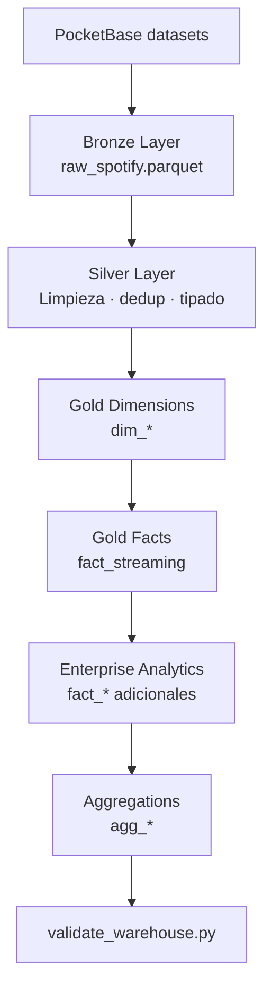

# ELT — Pipeline Medallion

## Resumen

El pipeline ELT transforma el dataset Spotify (~100k filas desde PocketBase) en un warehouse dimensional DuckDB listo para analytics.

**Pipeline canónico (única implementación autoritativa):** `analytics/elt/pipelines/elt_pipeline.py`
**Adaptador orquestado (Spec 048):** `analytics/elt/pipelines/orchestrated_pipeline.py` — invoca las mismas funciones por etapa; no duplica transforms.
**Comando ops CLI:** `make pipeline`
**Orquestación Airflow (local/demo):** `make airflow-up` → UI `:8081` → trigger manual `voxmetriks_elt`
**Output:** `data/warehouse/voxmetrik.duckdb`

**Backend runtime (no canónico para rebuild completo):** `apps/backend/app/etl/` — refresh Bronze→Silver→Gold *en proceso* cuando ya existe `raw_spotify`. Conservado como adaptador/consumidor; no duplicar el builder de dims/facts.

## Dos caminos de ejecución Medallion

| Camino | Qué hace | Cuándo |
|--------|----------|--------|
| CLI directo | `python analytics/elt/pipelines/elt_pipeline.py` / `make pipeline` | Rebuild completo sin Airflow |
| Orquestado | DAG `voxmetriks_elt` → subprocess por etapa del adaptador | Demo/académico; graph + logs en Airflow |

Ambos reutilizan `bronze_extract`, `silver_transform`, `gold_load_staging`, `gold_build_warehouse`, `_export_gold_parquets`, `verify_warehouse`. Handoff durable: Parquet + DuckDB (nunca DataFrames por XCom).

**Compose de aplicación** (`compose.yml`): solo `backend` + `frontend`.
**Compose Airflow** (`infrastructure/airflow/compose.yml`): Postgres de metadata del orquestador + LocalExecutor. **No** es el warehouse de negocio.

### Modo mantenimiento (DuckDB single-writer)

Antes de `make airflow-trigger` o de disparar el DAG en la UI:

1. Detener `start_demo.ps1` y/o `make down`.
2. Ejecutar el DAG.
3. Apagar Airflow (`make airflow-down`).
4. Volver a levantar la aplicación.

Si otro proceso bloquea el warehouse, `preflight` falla con mensaje accionable (no mata procesos ni borra `.wal`/`.duckdb`).

## Flujo completo



## Capas Medallion

| Capa | Ubicación disco | Tablas DuckDB | Responsabilidad |
|------|-----------------|---------------|-----------------|
| Bronze | `data/bronze/` | `raw_spotify`, `bronze_raw_tracks` | Extract sin transformar |
| Silver | `data/silver/` | `silver_tracks`, `silver_streams`, `silver_users` | Clean, normalize |
| Gold | `data/gold/` | `dim_*`, `fact_*`, `agg_*` | Modelo dimensional |
| App | Runtime API | `app_*` | Estado aplicación |

## Orden de ejecución Gold

1. `dim_tiempo`, `dim_usuario`, `dim_artista`, `dim_genero`, `dim_album`
2. `dim_track`, `dim_playlist`
3. `fact_streaming`
4. Agregaciones base: `agg_top_artistas`, `agg_genero_popularidad`, `agg_tracks_populares`
5. Enterprise (`analytics/elt/transform/enterprise_analytics.py`): facts adicionales + agg_* + `ctl_pipeline_stages`
6. Backend gold builders (`apps/backend/app/etl/gold/`): refresh incremental **solo** si boot lo solicita y existe `raw_spotify`

## Enterprise analytics

Archivo: `analytics/elt/transform/enterprise_analytics.py`

Genera tablas de comportamiento sintético/realista:
- Facts: `fact_user_activity`, `fact_searches`, `fact_stream_sessions`, etc.
- Aggs: `agg_daily_streams`, `agg_artist_growth`, `agg_genre_trends`, etc.
- Control: `ctl_pipeline_stages`

Los eventos sintéticos no deben presentarse como actividad real de usuarios.

## Boot automático

Al arrancar FastAPI (`run_system_boot()`):

1. Init directorios / warehouse
2. Si **no** existe el DuckDB → bootstrap con **analytics/elt** (canónico)
3. Según `RUN_ETL_ON_BOOT` (ver tabla)
4. Warm de caché dashboard (best-effort)
5. Validación (`utils/data_validation.py`)

| Valor | Comportamiento |
|-------|----------------|
| `never` / `off` / `false` / `0` | Sin ETL |
| `validate` / `validation-only` | Solo validación |
| `auto` / `if_missing` | Refresh backend si gold no listo; canónico solo si falta warehouse |
| `always` | Intenta refresh backend si hay `raw_spotify` |
| `full` / `rebuild` | Rebuild canónico explícito (largo; preferir `make pipeline` fuera del boot) |

**Deuda:** no hay worker/cola; un full rebuild no debe bloquear el arranque normal de la API.

## Ejecución manual

```bash
# Pipeline canónico completo (CLI)
python analytics/elt/pipelines/elt_pipeline.py
# o
make pipeline

# Una etapa orquestable (mismo ELT; útil para depurar)
python analytics/elt/pipelines/orchestrated_pipeline.py preflight --dag-run-id local-debug

# Refresh backend (requiere warehouse + raw_spotify)
make etl

# Solo validación (lectura)
python automation/scripts/validate_warehouse.py
```

## Orquestación Airflow (Spec 048)

```bash
make down            # mantenimiento: liberar DuckDB
make airflow-up      # init + stack; UI http://localhost:8081
make airflow-list
make airflow-trigger # o Trigger en la UI — schedule=None
make airflow-logs
make airflow-down
make up
```

Airflow **no** ejecuta el pipeline al arrancar. Metadata del orquestador vive en Postgres del stack Airflow; datos de negocio en DuckDB/Parquet bajo `VOXMETRIKS_DATA_DIR` (default `data/`).

## Variables ELT

| Variable | Descripción |
|----------|-------------|
| `DB_PATH` | Ruta DuckDB destino |
| `VOXMETRIKS_DATA_DIR` | Raíz Medallion (`bronze`/`silver`/`gold`/`warehouse`) |
| `POCKETBASE_URL` | URL PocketBase |
| `POCKETBASE_EMAIL` | Credencial extract |
| `POCKETBASE_PASSWORD` | Credencial extract |
| `RUN_ETL_ON_BOOT` | Ver tabla de modos arriba |

## Adaptador backend

`apps/backend/app/etl/canonical_adapter.py` resuelve e invoca el script canónico.
`apps/backend/app/etl/pipelines.py` permanece para tests y refresh en proceso.

## Control y auditoría

| Tabla | Contenido |
|-------|-----------|
| `ctl_carga_dataset` | Timestamp, filas, origen |
| `ctl_auditoria` | Operaciones DDL/DML |
| `ctl_pipeline_stages` | Duración por etapa Medallion |

Ver [database.md](../database/database.md) para catálogo completo.
