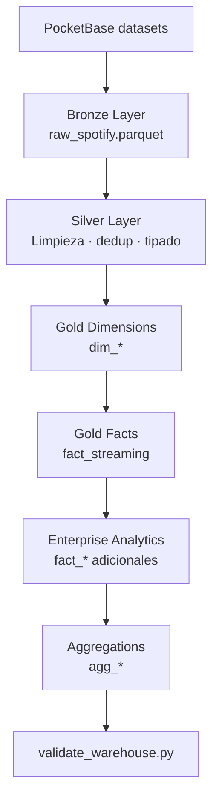

# ELT — Pipeline Medallion

## Resumen

El pipeline ELT transforma el dataset Spotify (~100k filas desde PocketBase) en un warehouse dimensional DuckDB listo para analytics.

**Script principal:** `elt/pipelines/elt_pipeline.py`  
**Output:** `data/warehouse/voxmetrik.duckdb`

## Flujo completo



## Capas Medallion

| Capa | Ubicación disco | Tablas DuckDB | Responsabilidad |
|------|-----------------|---------------|-----------------|
| Bronze | `data/bronze/` | `raw_spotify`, `bronze_raw_tracks` | Extract sin transformar |
| Silver | `data/silver/` | `silver_tracks`, `silver_streams`, `silver_users` | Clean, normalize |
| Gold | `data/gold/` | `dim_*`, `fact_*`, `agg_*` | Modelo dimensional |
| App | Runtime API | `app_*` | Estado aplicación |

## Orden de ejecución Gold

1. `dim_tiempo`, `dim_usuario`, `dim_artista`, `dim_genero`, `dim_album`
2. `dim_track`, `dim_playlist`
3. `fact_streaming`
4. Agregaciones base: `agg_top_artistas`, `agg_genero_popularidad`, `agg_tracks_populares`
5. Enterprise (`elt/transform/enterprise_analytics.py`): facts adicionales + 12 agg_*
6. Backend gold builders (`apps/backend/app/etl/gold/`): refresh incremental

## Enterprise analytics

Archivo: `elt/transform/enterprise_analytics.py`

Genera tablas de comportamiento sintético/realista:
- Facts: `fact_user_activity`, `fact_searches`, `fact_stream_sessions`, etc.
- Aggs: `agg_daily_streams`, `agg_artist_growth`, `agg_genre_trends`, etc.
- Control: `ctl_pipeline_stages`

## Boot automático

Al arrancar FastAPI (`run_system_boot()`):
1. Init warehouse si no existe
2. ETL si `RUN_ETL_ON_BOOT` lo permite
3. GOLD builders
4. Dashboard cache
5. Validación (`utils/data_validation.py`)

## Ejecución manual

```bash
# Pipeline completo
python analytics/elt/pipelines/elt_pipeline.py

# Solo validación
python automation/scripts/validate_warehouse.py

# Re-run en Docker
docker compose run --rm pipeline
```

## Variables ELT

| Variable | Descripción |
|----------|-------------|
| `DB_PATH` | Ruta DuckDB destino |
| `POCKETBASE_URL` | URL PocketBase |
| `POCKETBASE_EMAIL` | Credencial extract |
| `POCKETBASE_PASSWORD` | Credencial extract |
| `RUN_ETL_ON_BOOT` | `always` / `never` / `if_missing` |

## Backend ETL scaffold

`apps/backend/app/etl/` implementa builders modulares reutilizables:
- `bronze/bronze_loader.py`
- `silver/clean_*.py`
- `gold/*_analytics.py`
- `gold/gold_builder.py` — orquestador

## Control y auditoría

| Tabla | Contenido |
|-------|-----------|
| `ctl_carga_dataset` | Timestamp, filas, origen |
| `ctl_auditoria` | Operaciones DDL/DML |
| `ctl_pipeline_stages` | Duración por etapa Medallion |

Ver [database.md](../03-database/database.md) para catálogo completo.
