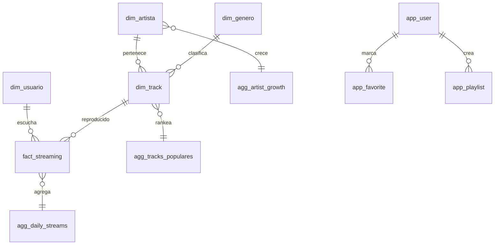

# Base de datos — Catálogo DuckDB

**Archivo canónico:** `data/warehouse/voxmetrik.duckdb`  
**Motor:** DuckDB 1.x · **Modelo:** Medallion + Kimball dimensional  
**Total tablas documentadas:** 48

## Leyenda de tipos

| Tipo | Prefijo | Descripción |
|------|---------|-------------|
| Raw | `raw_*`, `bronze_*` | Datos crudos sin transformar |
| Silver | `silver_*` | Datos limpios y normalizados |
| Dim | `dim_*` | Dimensiones analíticas |
| Fact | `fact_*` | Hechos de negocio |
| Agg | `agg_*` | Agregaciones pre-calculadas (Gold) |
| App | `app_*` | Estado runtime de la aplicación |
| Ctl | `ctl_*` | Control, auditoría, pipeline |

---

## Capa Raw / Bronze

### `raw_spotify`
| | |
|---|---|
| **Tipo** | Raw |
| **Propósito** | Espejo Bronze del dataset Spotify en DuckDB |
| **Columnas** | Estructura flexible según extract (track, artist, genre, streams, features) |
| **Relaciones** | Alimenta `dim_*` y `fact_streaming` vía ELT |
| **Uso** | Pipeline ELT, referencia histórica |

### `bronze_raw_tracks`
| | |
|---|---|
| **Tipo** | Raw (Bronze) |
| **Propósito** | Carga inicial de tracks desde fuentes externas |
| **Uso** | `apps/backend/app/etl/bronze/bronze_loader.py` |

---

## Capa Silver

### `silver_tracks` · `silver_streams` · `silver_users`
| | |
|---|---|
| **Tipo** | Silver |
| **Propósito** | Tracks, eventos de streaming y usuarios normalizados |
| **Uso** | Entrada a builders Gold; deduplicación y tipado |

---

## Dimensiones (`dim_*`) — 7 tablas

### `dim_track`
| Columna | Tipo | Descripción |
|---------|------|-------------|
| `id_track` | INTEGER PK | Identificador interno |
| `spotify_track_id` | VARCHAR | ID Spotify |
| `nombre_track` | VARCHAR | Título |
| `id_artista` | INTEGER FK | → dim_artista |
| `id_album` | INTEGER FK | → dim_album |
| `id_genero` | INTEGER FK | → dim_genero |
| `popularity` | INTEGER | 0–100 |
| `energy`, `danceability`, `valence`, `tempo` | DOUBLE | Audio features |
| `duration_ms` | INTEGER | Duración |
| `explicit` | BOOLEAN | Contenido explícito |

**Uso:** Catálogo musical, joins en facts y aggs.

### `dim_artista`
| Columna | Tipo | Descripción |
|---------|------|-------------|
| `id_artista` | INTEGER PK | ID interno |
| `nombre_artista` | VARCHAR | Nombre |

### `dim_genero`
| Columna | Tipo | Descripción |
|---------|------|-------------|
| `id_genero` | INTEGER PK | ID interno |
| `nombre_genero` | VARCHAR | Nombre del género |

### `dim_album`
| Columna | Tipo | Descripción |
|---------|------|-------------|
| `id_album` | INTEGER PK | ID interno |
| `nombre_album` | VARCHAR | Título del álbum |

### `dim_usuario`
| Columna | Tipo | Descripción |
|---------|------|-------------|
| `id_usuario` | INTEGER PK | ID analítico |
| `nombre_usuario` | VARCHAR | Alias |

### `dim_playlist`
| Columna | Tipo | Descripción |
|---------|------|-------------|
| `id_playlist` | INTEGER PK | ID interno |
| `nombre_playlist` | VARCHAR | Nombre |

### `dim_tiempo`
| Columna | Tipo | Descripción |
|---------|------|-------------|
| `id_tiempo` | INTEGER PK | Surrogate key temporal |
| `fecha` | DATE | Fecha calendario |
| `anio`, `mes`, `dia`, `dia_semana`, `hora` | INTEGER | Descomposición temporal |

---

## Hechos (`fact_*`) — 8 tablas

### `fact_streaming` (principal)
| Columna | Tipo | Descripción |
|---------|------|-------------|
| `id_stream` | INTEGER PK | ID evento |
| `id_usuario` | INTEGER FK | Usuario |
| `id_track` | INTEGER FK | Track reproducido |
| `played_at` / `fecha_evento` | TIMESTAMP | Momento del stream |
| `duration_ms` | INTEGER | Duración escuchada |
| `device_type`, `platform` | VARCHAR | Dispositivo (enterprise) |
| `skipped` | BOOLEAN | Skip flag (enterprise) |

**Uso:** Series temporales, peak hours, engagement. Preferir `agg_daily_streams` en dashboards.

### `fact_user_activity`
Eventos discretos: play, skip, like. Columnas: `id_activity`, `id_usuario`, `id_track`, `action_type`, `device_type`, `fecha_evento`.

### `fact_playlist_activity`
Acciones sobre playlists: add, remove, play. FK a `dim_playlist`, `dim_usuario`, `dim_track`.

### `fact_favorites`
Registro analítico de favoritos (`id_usuario`, `id_track`, `fecha_evento`).

### `fact_searches`
Búsquedas: `query_text`, `results_count`, `id_usuario`.

### `fact_stream_sessions`
Sesiones de escucha: `device_type`, `platform`, `session_start/end`, `tracks_played`, `skips`.

### `fact_audio_features` *(legacy en schema.sql)*
Referencia histórica; features actuales están en `dim_track`.

---

## Agregaciones (`agg_*`) — 17 tablas

| Tabla | Propósito | Uso en sistema |
|-------|-----------|----------------|
| `agg_daily_streams` | Streams diarios, usuarios únicos, skips | Dashboard, `/analytics/streams` |
| `agg_tracks_populares` | Top tracks con popularity y streams | `/tracks/top`, recomendaciones |
| `agg_artist_growth` | Crecimiento artistas 7d/30d | Dashboard overview |
| `agg_genre_trends` | Tendencias por género | Dashboard, analytics |
| `agg_genero_popularidad` | Popularidad agregada por género | Fallback genre trends |
| `agg_platform_usage` | Uso por plataforma/dispositivo | Device breakdown |
| `agg_streaming_devices` | Share por device_type | Analytics |
| `agg_user_engagement` | Segmentos de engagement | User insights |
| `agg_user_activity` | Totales por usuario | Recommendation engine |
| `agg_user_retention` | Cohortes retención | Analytics avanzado |
| `agg_recommendation_scores` | Scores pre-calculados | Fallback recomendaciones |
| `agg_top_artistas` | Ranking artistas | Legacy stats |
| `agg_top_playlists` | Playlists más reproducidas | Analytics |
| `agg_top_searches` | Queries frecuentes | Explorer |
| `agg_recent_activity` | Actividad reciente | Dashboard realtime |
| `agg_distribucion_energia` | Histograma energy | Audio features UI |
| `agg_dashboard_cache` | KPIs materializados | Boot rápido dashboard |

### Ejemplo detallado: `agg_daily_streams`

| Columna | Tipo | Descripción |
|---------|------|-------------|
| `fecha` | DATE PK | Día |
| `total_streams` | INTEGER | Total reproducciones |
| `unique_users` | INTEGER | Usuarios únicos |
| `unique_tracks` | INTEGER | Tracks únicos |
| `avg_duration_ms` | DOUBLE | Duración media |
| `skip_count` | INTEGER | Total skips |

---

## Tablas App (`app_*`) — 8 tablas

Creadas en runtime por la API (no por ELT).

| Tabla | Propósito |
|-------|-----------|
| `app_user` | Cuentas registradas (hash bcrypt) |
| `app_session` | Tokens Bearer activos |
| `app_email_code` | Códigos verificación registro |
| `app_favorite` | Favoritos por usuario |
| `app_playlist` | Playlists de usuario |
| `app_playlist_track` | Tracks en playlist |
| `app_track_audio_source` | Cache URL audio (YouTube/yt-dlp) |
| `app_track_cover` | Cache portadas |

---

## Control (`ctl_*`)

| Tabla | Propósito |
|-------|-----------|
| `ctl_carga_dataset` | Registro de cargas ELT |
| `ctl_auditoria` | Auditoría de operaciones |
| `ctl_pipeline_stages` | Etapas Medallion por run_id |
| `ctl_reporte` | *(legacy schema.sql)* |

---

## Diagrama entidad-relación simplificado

---

## Reglas de consulta

1. **Dashboard / KPIs** → `agg_*` exclusivamente.
2. **Detalle de evento** → `fact_*` con filtros de fecha acotados.
3. **Catálogo** → `dim_*` con paginación.
4. **Auth / UX** → `app_*` vía servicios legacy.

Ver [performance.md](../11-performance/performance.md) para optimización de queries.
