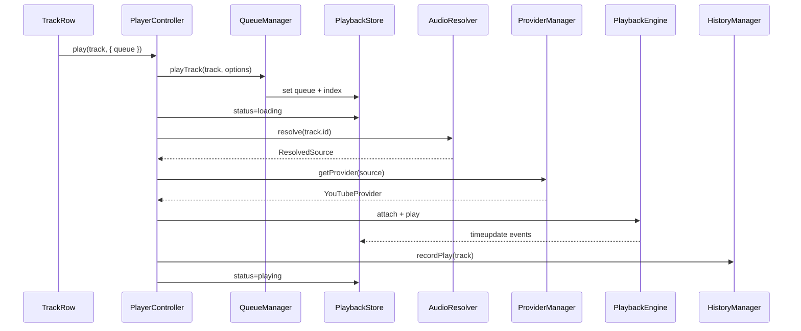

# PLAYBACK_ARCHITECTURE_V2 — Playback Core

**Fecha:** 2026-07-05  
**Estado:** Diseño propuesto — sin implementación de código de producción  
**Prerequisito:** [AUDIT_PLAYBACK_CORE.md](./AUDIT_PLAYBACK_CORE.md)

---

## 1. Visión

Convertir VOXMETRIKS en un reproductor de nivel **Spotify Desktop** mediante un núcleo desacoplado llamado **Playback Core**. Reemplazar el patrón actual (god service + factories dispersas + facades huérfanos) por contratos claros, un store reactivo único y managers especializados.

La UI (`PlayerBar`, `NowPlayingView`, filas, cards) se convierte en **vistas finas** que leen estado y emiten intents al `PlayerController`.

**Nota sobre estado actual:** Ya existe `apps/frontend/src/app/playback-core/` con piezas parciales (`QueueManager`, `FavoritesStore`, facades). V2 **consolida y completa** este trabajo — no empieza desde cero.

### Principios

- **Single Source of Truth** — `PlaybackStore` como única fuente observable.
- **Command/Query separation** — UI envía intents; managers mutan store.
- **Provider-agnostic engine** — audio vía interface `AudioProvider`.
- **Domain boundaries** — Queue, Favorites, Playlists, History fuera del engine.
- **Extensibility without rewrite** — nuevos features = manager o provider, no fork.

---

## 2. Mapa de módulos — Playback Core

```
┌──────────────────────────────────────────────────────────────────┐
│                        PLAYBACK CORE                              │
│  ┌─────────────┐  ┌──────────────┐  ┌─────────────────────────┐  │
│  │ Playback    │  │ Playback     │  │ Player Controller       │  │
│  │ Store       │◄─┤ Engine       │◄─┤ (facade pública / DI)   │  │
│  │ (global)    │  │ (transport)  │  └───────────┬─────────────┘  │
│  └──────▲──────┘  └──────▲───────┘              │ intents         │
│         │                 │                      │                 │
│  ┌──────┴─────────────────┴──────────────────────┴─────────────┐  │
│  │ Managers (domain logic, no DOM)                              │  │
│  │ Queue │ Favorites │ Playlist │ History │ Session │ Analytics│  │
│  └──────▲──────────────────────────────────────────────────────▲─┘  │
│         │                                                      │    │
│  ┌──────┴──────────┐                              ┌────────────┴──┐ │
│  │ Audio Resolver  │◄──── Provider Manager ────►│ Providers     │ │
│  │ (source pick)   │      (registry, priority)   │ YouTube|Demo  │ │
│  └─────────────────┘                              │ Blob|Podcast  │ │
│                                                    └───────────────┘ │
└──────────────────────────────────────────────────────────────────┘
                              │
┌─────────────────────────────▼────────────────────────────────────┐
│ UI Layer: PlayerBar │ NowPlaying │ QueuePanel │ TrackActions      │
│ Shared: TrackAdapter (API → domain Track)                          │
└──────────────────────────────────────────────────────────────────┘
```

---

## 3. Playback Store

### Responsabilidad

Estado de reproducción. **Única fuente de verdad** para transporte y cola activa. Reemplaza los signals dispersos en `MusicPlayerService` y el espejo redundante queue/queueIndex.

### Estado propuesto

```typescript
interface PlaybackState {
  // Transport
  status: 'idle' | 'loading' | 'playing' | 'paused' | 'buffering' | 'error';
  currentTrack: Track | null;
  currentSource: ResolvedSource | null;
  positionMs: number;
  durationMs: number;
  volume: number;
  muted: boolean;

  // Queue
  queue: QueueItem[];
  queueIndex: number;
  queueRevision: number;

  // Modes
  repeatMode: 'off' | 'all' | 'one';
  shuffle: boolean;
  shuffleOrder: number[] | null;
  autoplay: boolean;

  // Context (Spotify-style)
  context: PlaybackContext | null;

  // Computed selectors (no duplicar en componentes)
  canNext: boolean;
  canPrevious: boolean;
  upcomingTracks: Track[];

  // Error
  lastError: PlaybackError | null;

  // UI chrome (opcional en store o sub-slice)
  expandedOpen: boolean;
  currentCoverUrl: string | null;
}
```

### Implementación

- **Angular signals** como primario (alineado con codebase).
- Facade RxJS opcional para integraciones legacy.
- **Selectors** exportados: `selectCurrentTrack`, `selectQueue`, `selectTransport`.
- **Sin HTTP** en el store — effects en managers.

### Migración desde actual

| Actual | V2 |
|--------|-----|
| `MusicPlayerService` signals | `PlaybackStore` |
| `PlaybackStore` facade (huérfano) | Store real con write path |
| `QueueManager.revision` | `queueRevision` en store |

---

## 4. Playback Engine

### Responsabilidad

**Solo transporte de audio** — play, pause, seek, volume, time updates, ended.

### Contrato

```typescript
interface PlaybackEngine {
  attach(provider: AudioProvider, source: ResolvedSource): Promise<void>;
  detach(): void;
  play(): Promise<void>;
  pause(): void;
  seek(ms: number): void;
  setVolume(v: number): void;
  readonly events$: Observable<EngineEvent>;
}
```

### Reglas

- Un provider activo a la vez.
- Engine **no conoce** cola, favoritos ni playlists.
- `onEnded` → evento al **Player Controller**, no `next()` inline.
- Tick 250ms configurable.

### Migración

- Extraer de `PlayerPlaybackEngine` + hooks en `MusicPlayerService`.
- `YoutubeEngineService` → `YouTubeAudioProvider`.
- Demo WAV → `HtmlDemoProvider`.
- `PlaybackEngine` actual (wrapper) → engine real con attach/detach.

---

## 5. Queue Manager

### Responsabilidad

Toda mutación de cola + integración con `PlaybackHistoryStack` (Previous).

### API (intents)

```typescript
interface QueueManager {
  setQueue(items: Track[], startIndex: number, context?: PlaybackContext): void;
  playTrack(track: Track, options?: PlayOptions): void;
  insertNext(track: Track): void;
  appendUnique(tracks: Track[]): Track[];
  removeAt(index: number): void;
  move(from: number, to: number): void;
  clear(): void;
  clearPending(): void;
  advance(): Track | null;
  retreat(): Track | null;
}
```

### Modos Spotify-like

| Modo | Comportamiento |
|------|----------------|
| `replace` | Reemplaza cola (play album/playlist) |
| `play-now` | Inserta al frente y salta |
| `add-next` | Inserta después del actual |
| `append` | Añade al final |

### Shuffle / Repeat

- Shuffle: generar `shuffleOrder` sobre índices restantes; regenerar al togglear.
- Repeat: `off | all | one` — **ya existe lógica pura** en `playback-history.ts`; mover a `queue.logic.ts` y conectar al store.

### Migración

- `QueueManager` + `PlayerQueue` actuales son base sólida.
- Eliminar espejo `MusicPlayerService.queue` — UI lee store directamente.

---

## 6. Favorites Manager

### Responsabilidad

CRUD favoritos + sync backend. **Independiente** del engine.

### API

```typescript
interface FavoritesManager {
  readonly favoriteIds: Signal<ReadonlySet<number>>;
  isFavorite(trackId: number): boolean;
  toggle(trackId: number): Promise<void>;
  hydrate(): Promise<void>;
}
```

### Migración

- `FavoritesStore` actual → renombrar/evolucionar a `FavoritesManager`.
- `FavoriteBtnComponent` ya usa `FavoritesStore` — migración mínima.

---

## 7. Playlist Manager

### Responsabilidad

Estado playlists usuario + CRUD + reorder + `playPlaylist()`.

### API

```typescript
interface PlaylistManager {
  list(): Signal<PlaylistSummary[]>;
  getDetail(id: number): Signal<PlaylistDetail | null>;
  create/update/delete(...): Promise<void>;
  addTrack(playlistId, trackId): Promise<void>;
  removeTrack(playlistId, trackId): Promise<void>;
  reorderTracks(playlistId, orderedIds: number[]): Promise<void>;
  playPlaylist(id: number, startIndex?: number): void;
}
```

### Sync

- Cache memoria + invalidación por mutación.
- Optimistic updates con rollback.
- `playPlaylist` → QueueManager con `context: { type: 'playlist', id }`.

---

## 8. History Manager

### Responsabilidad

Historial UX "recientemente reproducido" — **separado** de analytics warehouse.

| Sistema | Propósito | Storage |
|---------|-----------|---------|
| `HistoryManager` | UI recents | localStorage (+ API futuro) |
| `PlaybackHistoryStack` | Botón Previous | memoria + session persist |
| `StreamAnalyticsManager` | fact_streaming | Backend v2 |

Hoy `HistoryService` se mezcla con side-effects en `loadTrack`. V2: `HistoryManager.recordPlay()` invocado explícitamente desde Controller.

---

## 9. Audio Resolver

### Responsabilidad

Dado un `Track`, producir `ResolvedSource`.

```
Track → AudioResolver.resolve(trackId)
  → in-memory cache map
  → GET /api/v1/tracks/{id}/audio-source (poll pending)
  → ProviderManager.pickProvider(source)
  → ResolvedSource
```

### Reglas

- Resolver **no reproduce**.
- Errores tipados: `NOT_FOUND`, `PROVIDER_UNAVAILABLE`, `TIMEOUT`.
- Retry policy centralizada.
- Migrar desde `PlayerSourceResolver` (instanciado con `new` hoy → injectable singleton).

---

## 10. Provider Manager

### Contrato Provider

```typescript
interface AudioProvider {
  readonly id: string;
  canPlay(source: ResolvedSource): boolean;
  createPlayer(): ProviderPlayer;
}
```

### Cadena fallback v1

1. YouTube (videoId)
2. HTML Demo WAV
3. (futuro) Cached blob
4. (futuro) HLS / direct URL

### Extensión futura

Registrar en bootstrap: `PodcastProvider`, `AiGeneratedProvider`, `DownloadProvider`, `BlobCacheProvider`.

---

## 11. Player Controller

### Responsabilidad

**Facade pública única** — punto de entrada para UI y páginas.

```typescript
@Injectable({ providedIn: 'root' })
class PlayerController {
  readonly store: PlaybackStore;
  readonly queue: QueueManager;
  readonly favorites: FavoritesManager;
  readonly playlists: PlaylistManager;
  readonly history: HistoryManager;

  play(track: Track, options?: PlayOptions): Promise<void>;
  pause(): void;
  resume(): void;
  togglePlay(): void;
  seek(ms: number): void;
  next(): Promise<void>;
  previous(): Promise<void>;
  setRepeat(mode: RepeatMode): void;
  setShuffle(on: boolean): void;
  setAutoplay(on: boolean): void;
  stop(): void;
}
```

### Orquestación play

```
Controller.play(track, opts)
  → QueueManager.playTrack(...)
  → Store: LOADING
  → AudioResolver.resolve(track)
  → Engine.attach(provider, source)
  → Engine.play()
  → Store: PLAYING
  → HistoryManager.recordPlay(track)
  → StreamAnalyticsManager.startSession(track)
```

### Migración

- `PlayerController` actual (thin delegate) → reimplementar como orquestador real.
- `MusicPlayerService` → adapter deprecated → eliminar.

---

## 12. Global State — unificación

| Antes (audit) | Después (V2) |
|---------------|--------------|
| MusicPlayerService signals | PlaybackStore |
| PlayerQueue + espejo signals | QueueManager + store.queue |
| FavoritesService BehaviorSubject | FavoritesManager |
| HistoryService | HistoryManager |
| ListenStats tick | StreamAnalyticsManager + optional local UX |
| 8+ PlayableTrack factories | `TrackAdapter.fromApi()` único |
| Colas locales por página | Pasar `Track[]` API; Controller construye cola |

---

## 13. Capa UI

### PlayerBar / NowPlayingView

- Leen `PlaybackStore` via `PlayerController`.
- Sin lógica de negocio.
- Controles compartidos → `PlayerTransportControlsComponent`.

### TrackActions (nuevo)

Unificado: Play, Favorite, Add to Queue, Add to Playlist. Usable en TrackRow, MediaCard, Search, Home tiles.

### PlayableTrack → Track

Domain `Track` en core; `PlayableTrack` deprecated durante migración.

---

## 14. Backend — alineación

### Sin cambios obligatorios fase 1

- `/audio-source` sigue igual.

### Extensiones recomendadas

| Endpoint | Propósito |
|----------|-----------|
| `PATCH /playlists/{id}/tracks/reorder` | Drag reorder |
| `POST /api/v2/stream/*` | StreamAnalyticsManager |
| `GET /tracks/{id}/lyrics` | Letras (futuro) |
| `GET /tracks/{id}/providers` | Multi-provider metadata |

---

## 15. Preparación requisitos futuros

| Requisito | Soporte V2 |
|-----------|------------|
| Favoritos everywhere | FavoritesManager + TrackActions |
| Cola global persistente | QueueManager + SessionPersistence |
| Play next / drag queue | QueueManager API + QueuePanel UI |
| Multi-provider | ProviderManager registry |
| IA / radio | `RadioManager` → QueueManager |
| Podcasts | `PodcastProvider` + mediaType |
| Letras sync | `LyricsManager` + engine timeupdate |
| Descargas / cache | `OfflineManager` + BlobProvider |
| PWA | Service Worker + OfflineManager |
| Desktop | Mismo core; native provider opcional |
| Analytics warehouse | StreamAnalyticsManager → v2 |

---

## 16. Estructura de carpetas propuesta

```
apps/frontend/src/app/playback-core/
  index.ts
  controller/player.controller.ts      ← reimplementar (hoy: thin delegate)
  store/
    playback.store.ts                    ← reimplementar (hoy: read-only facade)
    playback.state.ts
    playback.selectors.ts
  engine/
    playback.engine.ts                   ← evolucionar wrapper actual
    engine.events.ts
  queue/
    queue.manager.ts                     ← EXISTS — evolucionar
    queue.logic.ts                       ← consolidar playback-history.ts
  favorites/
    favorites.manager.ts                 ← evolucionar favorites.store.ts
  playlists/
    playlist.manager.ts                  ← NEW
  history/
    history.manager.ts                   ← NEW
  analytics/
    stream-analytics.manager.ts          ← NEW
  resolver/
    audio.resolver.ts                    ← migrar player-source.resolver.ts
  providers/
    provider.manager.ts
    youtube.provider.ts
    html-demo.provider.ts
    provider.interface.ts
  session/
    session.persistence.ts               ← migrar player-session.storage.ts
  adapters/
    track.adapter.ts                     ← consolidar player-track.factory.ts
  models/
    track.model.ts
    queue-item.model.ts
    playback-context.model.ts

shared/components/
  player-bar/                              ← thin
  now-playing-view/                        ← thin
  player-transport-controls/               ← NEW
  track-actions/                           ← NEW
  queue-panel/                             ← NEW
```

---

## 17. Diagrama de secuencia — Play



---

## 18. Estrategia de migración

1. Completar `PlaybackStore` con write path (hoy solo read facade).
2. Reimplementar `PlayerController` como orquestador (hoy delega a god service).
3. Migrar UI componente a componente → `PlayerController`.
4. `MusicPlayerService` → adapter thin → eliminar.
5. Conectar stream v2 en fase analytics.

**No big-bang.** Feature flag `USE_PLAYBACK_CORE` para rutas críticas.

---

## 19. Beneficios

| Beneficio | Impacto |
|-----------|---------|
| Single Source of Truth | UI consistente, debug predecible |
| Testabilidad | Managers puros, engine mockeable |
| Extensibilidad | Nuevos providers sin tocar cola |
| UX Spotify-grade | Queue editable, context, analytics |
| Menos duplicación | Un adapter, un transport UI |
| Aprovecha trabajo parcial | QueueManager, FavoritesStore, repeat modes ya existen |
| Preparado PWA/Desktop | Core desacoplado de DOM |

---

## 20. Riesgos

| Riesgo | Mitigación |
|--------|------------|
| Migración larga, doble mantenimiento | Adapter + feature flag; eliminar god service ASAP |
| Facades huérfanos confunden | Documentar y migrar UI en fase 3-4 |
| YouTube iframe acoplamiento | Encapsular en provider único |
| Regresiones UX | E2E play flows por fase |
| Session restore + autoplay policies | Restaurar paused; user gesture para play |
| Scope creep fase 7 | Sub-fases independientes post-MVP |

---

## 21. Dependencias

- Angular 17+ signals (en uso)
- Backend `/audio-source` estable
- Backend v2 stream (fase analytics)
- `@angular/cdk/drag-drop` (queue/playlist reorder UI)
- Futuro: IndexedDB, Service Worker, hls.js

---

*Fin del diseño V2 — implementación pendiente por fases en ROADMAP_PLAYBACK.md.*
