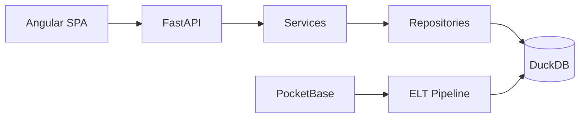

# VOXMETRIK_V2 — Portfolio

[](https://python.org)
[](https://fastapi.tiangolo.com)
[](https://angular.io)
[](https://duckdb.org)
[](apps/backend/tests/)
[](../08-testing/testing.md)

> **Streaming analytics platform** — Spotify-like UX meets enterprise data warehouse. Built with FastAPI, Angular 21, and DuckDB Medallion architecture.

---

## Highlights

- 🎵 **Full streaming experience** — catalog, player, playlists, favorites, search
- 📊 **Analytics Hub** — ECharts dashboards powered by GOLD aggregates
- 🎯 **Explainable recommendations** — heuristic scoring, no black-box ML
- 🏗️ **Medallion ELT** — Bronze → Silver → Gold → 48 warehouse tables
- 🔒 **Production baseline** — JSON logging, rate limiting, uniform error envelope
- 🐳 **Docker Compose** — one command full stack

---

## Tech stack

| Layer | Technology |
|-------|------------|
| Frontend | Angular 21, RxJS, Material, ECharts |
| Backend | FastAPI, Pydantic, Uvicorn |
| Database | DuckDB (OLAP warehouse) |
| ETL | Python, Pandas, PocketBase |
| Testing | pytest, TestClient |
| DevOps | Docker Compose, Makefile |

---

## Architecture



See [docs/architecture/architecture.md](../02-architecture/architecture.md) for full diagrams.

---

## Features

| Feature | Description |
|---------|-------------|
| Enterprise Dashboard | KPIs, genre trends, device usage, growth charts |
| Recommendation Engine | 4-factor weighted scoring with human-readable reasons |
| Data Explorer | Engineer role — preview warehouse tables |
| ELT Pipeline UI | Visual pipeline status for data engineers |
| Auth | Email verification, Google Sign-In, RBAC |
| i18n | English / Spanish |

---

## Screenshots

> Placeholders — add captures to `docs/screenshots/`

| Dashboard | Discover | API Docs |
|-----------|----------|----------|
|  |  |  |

---

## Quick start

```bash
git clone <repo> && cd voxmetriks
cp .env.example .env
docker compose -f infrastructure/docker/docker-compose.yml up --build
# → http://localhost:8080 (frontend)
# → http://localhost:8000/docs (API)
```

Demo: `demo` / `demo123`

---

## Project metrics

| Metric | Count |
|--------|------:|
| API endpoints | 93 |
| Warehouse tables | 48 |
| Angular components | 46 |
| Backend LOC | ~12,000 |
| Test coverage | ~75% |

---

## Documentation

Full docs in [`docs/`](../README.md):

- [Architecture](../02-architecture/architecture.md) · [Database](../03-database/database.md) · [API](../07-api/api.md)
- [Deployment](../09-deployment/deployment.md) · [Security](../10-security/security.md)
- [Presentation Guide](../13-presentation/presentation-guide.md) · [Roadmap](../14-roadmap/roadmap.md)

---

## Roadmap

| Version | Focus |
|---------|-------|
| v2.1 | Redis cache, CI/CD, unified DB layer |
| v2.5 | OpenTelemetry, Prometheus |
| v3.0 | Hybrid ML recommendations |
| Enterprise | Multi-tenant B2B |
| Cloud | Snowflake + Kubernetes |

See [docs/roadmap/roadmap.md](../14-roadmap/roadmap.md).

---

## Contributing

See [docs/contributing.md](../contributing.md).

---

## License

Academic project — Voxmetriks. Use per course or client guidelines.
